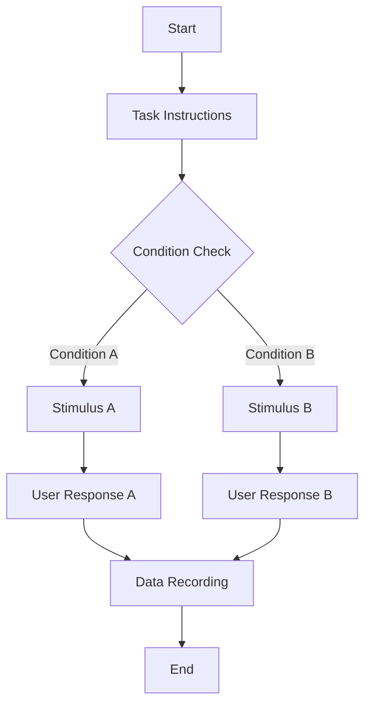

## Description
A specialized skill for analyzing psychology research papers to extract experimental designs, generate flowcharts, and document visual stimuli parameters.

## Preparation

### Input Requirements
- Psychology research paper in markdown format
- Paper must contain detailed experimental methods sections
- Should include stimulus descriptions and experimental procedures

### Step 1: Experiment Identification
- Read the full content of the paper
- Identify and list all experiments described in the paper (Exp1, Exp2... or Exp1a, Exp1b, Exp2...)
- Number and name each experiment
- Extract research objectives and hypotheses for each Experiment
- If the original paper is too large to read in one go, read it in multiple passes

### Step 2: Detailed Flowchart Generation
For each experiment, generate following things into `exp_design.md`

#### Mermaid Flowchart
- Use standard Mermaid syntax
- Strictly avoid parentheses in node labels
- Clear node type labeling:
  - **Image Stimulus Nodes**: Visual stimulus presentation
  - **Text Stimulus Nodes**: Text information display
  - **Interaction Nodes**: User choice/reaction points
  - **Timing Nodes**: Time measurement points

#### Node Annotations (outside Mermaid)
**Text Stimulus Nodes:**
- Task instructions at experiment start
- Specific guidance text
- Feedback message descriptions

**Image Stimulus Nodes:**
- Detailed image composition description
- Visual element arrangement
- Color, shape, size visual features
- Examples: "Red circle at screen center, 5cm diameter, gray background"

**User Interaction Nodes:**
- Specific user actions (key press, mouse click, verbal response)
- Recorded data metrics:
  - Reaction time (milliseconds)
  - Accuracy rate (percentage)
  - Choice results (binary or multi-category)
  - Error types

#### Experiment Difference Explanation
- If experiments are similar, detail specific differences
- Variable control variations
- Stimulus material changes
- Measurement metric additions/modifications

### Step 3: Visual Stimulus Parameter Documentation

#### Image Enumeration
For each image node used in experiments:
- Image number and description
- Usage context in experiment

#### Detailed Parameter Specifications
First, you need to locate the descriptions in the original paper and insert them into the corresponding sections of `exp_design.md` using Markdown block quotes (`>`).
Second, you must use MCP or READ tools that can display images to inspect all the example stimuli provided in the experimental sections so you have a concrete understanding rather than imagining the stimuli from text alone.
After that, determine which concrete parameters are required to recreate those stimuli and identify which figure in the paper contains each stimulus example.
Note that the paper figures are stored in a separate folder and referenced by the paper's markdown file.

**Geometric Parameters:**
- Position coordinates (X, Y)
- Shape type (circle, square, triangle, etc.)
- Size parameters (diameter, side length, radius, etc.)
- Rotation angle (degrees)

尤其是，你需要明确画布的具体分辨率（也就是屏幕的整体分辨率，这样你的X Y坐标才有意义），以及画布的背景颜色，如果没有标注背景颜色默认取白色。
注意，论文一般会标注visual angle，而visual angle到像素的换算方法会在下面标注。

**Visual Parameters:**
- Color values (RGB/HEX)
- Transparency
- Border style and color
- Fill style

#### Parameter Importance
You need to specify which parameters for an image are randomly chosen in the experiment and which are important for result analysis (and therefore must be recorded).

If a parameter is random and never recorded, describe all possible cases and their probabilities.

If a parameter should be recorded, list every case (for example, four different shape types).

#### Pixel Conversion Specification
**Conversion Standards:**
You need to find the screen size, resolution, and viewing distance that the paper specifies.

If that information is missing, fall back to the default:
- 17-inch CRT monitor, $1024 \times 768$ resolution.
- Viewing distance $D = 50\text{ cm}$. 

DPI calculation:
Diagonal pixels: $\sqrt{1024^2 + 768^2} = 1280 \text{ px}$; assuming the 17-inch diagonal equals the display area diagonal (standard CRT estimate): DPI $\approx 1280 / 17 \approx \mathbf{75.3 \text{ PPI}}$

Conversion formula: for a visual angle $\theta$ (degrees), screen physical size $S$ (cm), and pixels $P$ (px):

$$
S = 2 \times D \times \tan\left(\frac{\theta}{2}\right)
$$

$$
P = S \times \frac{\text{DPI}}{2.54}
$$

### Output Example

```markdown
# Psychology Experiment Analysis Report

## Step 1: Experiment Identification
- Experiment 1: Color Judgment Task
- Experiment 2: Shape Discrimination Task

## Step 2: Detailed Flowcharts

### Experiment 1 Flowchart


**Node Annotations:**
- Node B (Text Stimulus): "Please carefully observe the shapes on screen and judge their colors"
- Node D (Image Stimulus): "Red circle at screen center, diameter corresponds to 2 degrees visual angle"
- Node F (User Interaction): "Press F key for red, J key for blue, record reaction time and accuracy"

### Experiment 2 Flowchart
[Similar structure...]

**Experiment Difference Explanation:**
Experiment 2 reduced stimulus presentation time from 500ms to 250ms, increasing difficulty...

## Step 3: Visual Stimulus Parameters

### Image 1: Red Circle
- Usage Context: Color judgment task in Experiment 1
- Position: Screen center (X: 960, Y: 540)
- Shape: Circle
- Diameter: 2 degrees visual angle → 192 pixels
- Color: RGB(255, 0, 0)
- Rotation Angle: 0 degrees

### Image 2: Blue Square
[Detailed parameters...]
```

### Technical Specifications
- Mermaid syntax strictly compliant, avoiding compilation errors
- All size parameters dual-labeled (visual angle + pixels)
- Data metrics explicitly quantified
- Stimulus descriptions specific and reproducible

## Code Generation

### Input requirements

(Use uv as python env management)

- Paper in markdown formats
- The generated markdown in preparse stage
- Downloaded Experiment Public Data of the paper (The data could be in zip, rar, tar.gz, xlsx, docx, etc. You need to read these data using python scripts, especially for xlsx, make sure you have read all the tab and table in the file, not just the first one)

### Step 1: Check Public Data

You need to load the public exp data using python scripts and check for each experiment that if all the parameter you expected in prepare stage are recorded.

You need to progressively adjust your expectations to reconstruct the original experiment data as precisely as possible. For instance, if an image might change color over time, the most precise approach is to record the before-and-after colors, but if those details are missing you can settle for logging whether a color change occurred and randomly selecting colors from the allowed list based on that change (since the exact hues might not matter to the analysis, only whether a change occurred). Likewise, if a dataset lists shape IDs without mapping to shape types, you may invent a plausible mapping yourself. Similar flexibility applies to distractor shapes: you might only care whether the shape appeared and whether its color matched another stimulus, so you can randomly choose positions if they are unrecorded.

At this stage you must carefully cross-check the experimental design in the original paper to avoid misunderstandings, such as misinterpreting vertical alignment as horizontal or applying an incorrect rotation angle. You must also re-read the images tagged during the Preparation phase to ensure your interpretation matches the paper's diagrams.

Confirm that you have reviewed every downloaded experiment data file; it is extremely rare for one experiment's data to be missing while others exist, but if you suspect that scenario double-check for any unexamined files.

Once you finish this verification, supplement `exp_design.md` with notes describing which parameters were randomized, which were precisely recorded, which were unused, and how each data file maps to its experiment. Include the actual column names from the data and how they correspond to the parameters mentioned in your document.
Remember that this step is purely additive: do not remove any content created during the Preparation stage. Also, do not proceed to the code implementation phase until you have verified the image parameters for every experiment.

### Step 2: Code Implementation.

Only after thoroughly understanding the image parameters should you begin writing code to recreate the original stimuli.

Create an `experiment` folder, `cd` into it, and use `uv init` to create the Python environment. Install dependencies through `uv add`, run programs with `uv run`, and avoid using `uv pip install`, since it does not update the dependency list.

Because the experiments may require extensive graphics, prefer using `sympy` and `pyx` for geometric drawing, outputting results to `output/<experiment-number>`. Produce SVG images and also export a jpg with the same name. Work through the experiments sequentially rather than coding them all at once, and add a `--limit` parameter to restrict the number of trials (rows in the experiment data) processed. Include debug logging that prints the parameters associated with each generated image. After finishing an experiment's code, run it immediately with a timeout and a small `--limit` value to ensure no infinite loops occur; 

!Important: inspect the generated jpg and their debug logs to confirm the stimuli match the requirements. If they do not, iterate until they do.

注意，对于你在 Preparation 阶段创建的每一个图像刺激节点，都应该创建一个独立的图片，而不是将一个实验的一次Trial的所有图像刺激都绘制到一张图中，这是错误的。别忘了看论文中对应的示例图片，确保生成结果的和示例保持相似，而不是生成完全不同的自由发挥的图片。

对于所有的图像刺激，请不要在其中添加文本tag或者标题，这会涉及到字体处理，我们要避免这一点。如过需要表明这是search job，可以将search这种后缀添加到文件名中。
对于流程图中提到的文本描述的刺激，比如给受试者的Guidance Prompt，可以为每个trial单独创建一个txt文件来保存，注意文件命名，你同样可以增加后缀来区分一个trial内的多个文本描述。

而且，创建刺激图像时，你需要注意图像的画布的颜色和大小，不要只关心形状本身，只有图像处于正确的背景下，有正确的大小比例时，这个刺激才是正确的刺激。

下面是一个使用scipy 和 pyx绘图的简单示例代码：
```python
# uv add numpy scipy pyx
import numpy as np
from scipy.spatial.transform import Rotation as R
from pyx import canvas, path, color, style
import pyx.bitmap

# --------- 一点小几何封装（用 SciPy 做变换）---------

def rotate_points(points, angle_deg):
    """
    用 SciPy 把一组 2D 点绕原点旋转 angle_deg 角度。
    points: (N, 2) 数组
    """
    rot = R.from_euler("z", angle_deg, degrees=True)
    pts3d = np.column_stack([points, np.zeros(len(points))])  # 提升到 3D
    return rot.apply(pts3d)[:, :2]


# 以原点为中心的“+”号，由两条线段组成
def plus_shape(size):
    s = size
    segs = np.array([
        [[-s, 0], [s, 0]],   # 横线
        [[0, -s], [0, s]],   # 竖线
    ])
    return segs


# 用旋转得到 “X” 和 “/”
def x_shape(size):
    # 把 “+” 旋转 45° 就是 “X”
    return np.array([rotate_points(seg, 45) for seg in plus_shape(size)])


def slash_shape(size):
    # 取 “+” 中的横线，旋转 45°，得到斜杠 “/”
    base = plus_shape(size)[0]           # 只要横线那一段
    return rotate_points(base, 45)       # (2, 2)


# --------- 场景参数 ---------

ring_radius   = 3.0   # 圆环半径（决定八个小圆的位置）
circle_radius = 0.6   # 每个小圆半径
marker_size   = 0.35  # 圆里记号的线段长度

n_circles = 8
angles = np.linspace(0, 2*np.pi, n_circles, endpoint=False)
centers = np.stack([ring_radius*np.cos(angles),
                    ring_radius*np.sin(angles)], axis=1)

# SciPy 生成几何“记号”对象（都在局部坐标系，中心在原点）
plus_segments  = plus_shape(marker_size)
x_segments     = x_shape(marker_size)
slash_segment  = slash_shape(marker_size)

# 哪个圆是黄色，哪个圆里画 “/”
highlight_index = 4   # 左侧那个
slash_index     = 2   # 上方那个


# --------- 用 PyX 画图 ---------

c = canvas.canvas()
lw = style.linewidth(0.05)   # 线宽

# 中心 “+”
for seg in plus_segments:
    (x1, y1), (x2, y2) = seg
    c.stroke(path.line(x1, y1, x2, y2), [lw])

# 周围 8 个圆
for i, (cx, cy) in enumerate(centers):
    # 填充颜色：一个黄，其余灰
    fillcol = color.rgb(1, 1, 0) if i == highlight_index else color.rgb(0.85, 0.85, 0.85)
    circle_path = path.circle(cx, cy, circle_radius)
    c.fill(circle_path, [fillcol])
    c.stroke(circle_path, [lw])

    # 决定画 “X” 还是 “/”
    if i == slash_index:
        # 画一个斜杠
        (x1, y1), (x2, y2) = slash_segment + np.array([cx, cy])
        c.stroke(path.line(x1, y1, x2, y2), [lw])
    else:
        # 画一个 “X”（两条斜线）
        for seg in x_segments:
            (x1, y1), (x2, y2) = seg + np.array([cx, cy])
            c.stroke(path.line(x1, y1, x2, y2), [lw])

c.writeSVGfile("scipy_pyx_demo")
pyx.bitmap.render(c, "scipy_pyx_demo.jpg", dpi=300)
```

### Step 3: Code Execution

Once a small batch passes, raise the log level so debug output stops, remove the timeout and limit restrictions, and run the code to generate stimuli (please read the jpg file) for all experiment data. Finally, verify that the number of generated images matches expectations.

Make sure you have completed stimulus generation for every experiment before moving to Step 4.

### Step 4: Report Writing

Create `report.md` detailing any difficulties encountered during coding, potential risks where the generated images might deviate from the original stimuli, and instructions for running your scripts to reproduce those images.
