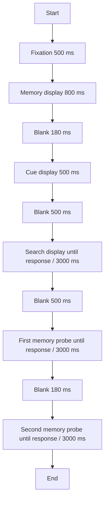

# Experimental Design Specification

## Paper-level apparatus summary

```json
{
  "paper_meta": {
    "title": "The object as the unit for state switching in visual working memory",
    "year": "2024",
    "authors": ["Shengnan Zhu", "Yongqi Li", "Yingtao Fu", "Jun Yin", "Mowei Shen", "Hui Chen"]
  }, 
  "apparatus": {
    "display": {
      "type": {"value": "CRT", "source": "paper", "status": "reported"},
      "size_inch": {"value": 17, "source": "paper", "status": "reported"},
      "refresh_hz": {"value": 100, "source": "paper", "status": "reported"},
      "resolution_px": {"value": [1024, 768], "source": "paper", "status": "reported"},
      "viewing_distance_cm": {"value": 50, "source": "paper", "status": "reported"},
      "background_rgb": {"value": [255, 255, 255], "source": "paper", "status": "reported"}
    },
    "software": {
      "platform": {"value": "MATLAB", "source": "paper", "status": "reported"},
      "toolbox": {"value": "Psychophysics Toolbox", "source": "paper", "status": "reported"}
    },
    "color_management": {
      "color_space": {"value": "unknown", "source": "paper", "status": "missing"},
      "gamma_corrected": {"value": "unknown", "source": "paper", "status": "missing"}
    }
  },
  "stimulus_libraries": {
    "color_sets": [
      {
        "id": "CSET1",
        "description": "Five colors used in all experiments",
        "colors": [
          {"name": "red", "rgb": [255, 0, 0]},
          {"name": "green", "rgb": [0, 255, 0]},
          {"name": "blue", "rgb": [0, 0, 255]},
          {"name": "yellow", "rgb": [255, 255, 0]},
          {"name": "purple", "rgb": [255, 0, 255]}
        ],
        "evidence_quote": "RGB values = 255, 0, 0 [red]; 0, 255, 0 [green]; 0, 0, 255 [blue]; 255, 255, 0 [yellow] and 255 0, 255 [purple]"
      }
    ],
    "shape_sets": [
      {
        "id": "SSET1",
        "description": "Five shapes used in Experiment 1",
        "shapes": ["square", "diamond", "trapezoid", "triangle", "hexagon"],
        "evidence_quote": "square, diamond, trapezoid, triangle, and hexagon"
      }
    ],
    "text_templates": [
      {
        "id": "T_cue_color",
        "role": "cue",
        "content_template": "Chinese character for 'color'",
        "examples": ["颜色"],
        "evidence_quote": "cue indicating which feature would be probed first (shape or color)"
      },
      {
        "id": "T_cue_shape",
        "role": "cue",
        "content_template": "Chinese character for 'shape'",
        "examples": ["形状"],
        "evidence_quote": "cue indicating which feature would be probed first (shape or color)"
      },
      {
        "id": "T_cue_up",
        "role": "cue",
        "content_template": "Chinese character for 'up'",
        "examples": ["上"],
        "evidence_quote": "cue indicating the order of the probes was presented as a Chinese character: up or down"
      },
      {
        "id": "T_cue_down",
        "role": "cue",
        "content_template": "Chinese character for 'down'",
        "examples": ["下"],
        "evidence_quote": "cue indicating the order of the probes was presented as a Chinese character: up or down"
      }
    ],
    "other_assets": []
  },
  "experiments": []
}
```

## Experiment 1

**Objective**: Determine whether two different features (color and shape) from a single object could be retained as distinct states.

**Hypotheses**:
- Feature‑based hypothesis: Different features within a single object can exist in different states (only the first‑probed color captures attention).
- Object‑based hypothesis: All features of an object must share the same state (both colors capture attention regardless of probe order).

**Participants**:
- 60 participants randomly divided into integrated group (n=30) and separate group (n=30).
- Exclusions: trials with RT > 3 SD or incorrect search/memory response.
- Grouping: between‑subjects (integrated vs separate).

**Groups**:
- `integrated`: memorize color and shape of a single colored‑shape object.
- `separate`: memorize shape of a black shape and color of a colored circle (two separate objects).

**Conditions** (within‑subject):
- Distractor type: `related_first`, `related_second`, `unrelated`, `no_singleton`.
- Probe order: cued by Chinese character “color” or “shape”.

**Critical factors**:
- Objecthood (integrated vs separate)
- Probe order (first vs second)
- Distractor relation (match first, match second, unrelated, no singleton)

**Trial flow**:



**Text stimuli**:

```json
[
  {
    "id": "T_fix",
    "role": "fixation",
    "content_template": "+",
    "presentation": {
      "position": {"value": [0, 0], "unit": "deg", "source": "paper", "status": "derived"},
      "font_family": "unknown",
      "font_size_pt": {"value": "unknown", "source": "paper", "status": "missing"},
      "font_color_rgb": {"value": [0, 0, 0], "source": "paper", "status": "derived"}
    },
    "timing": {
      "duration_ms": {"value": 500, "source": "paper", "status": "reported"}
    },
    "evidence_quote": "500 ms fixation display"
  },
  {
    "id": "T_cue_color",
    "role": "cue",
    "content_template": "Chinese character for 'color'",
    "presentation": {
      "position": {"value": [0, 0], "unit": "deg", "source": "paper", "status": "derived"},
      "font_family": "unknown",
      "font_size_pt": {"value": "unknown", "source": "paper", "status": "missing"},
      "font_color_rgb": {"value": [0, 0, 0], "source": "paper", "status": "derived"}
    },
    "timing": {
      "duration_ms": {"value": 500, "source": "paper", "status": "reported"}
    },
    "evidence_quote": "one of the memory features (shape or color) was cued using 500 ms Chinese characters"
  },
  {
    "id": "T_cue_shape",
    "role": "cue",
    "content_template": "Chinese character for 'shape'",
    "presentation": {
      "position": {"value": [0, 0], "unit": "deg", "source": "paper", "status": "derived"},
      "font_family": "unknown",
      "font_size_pt": {"value": "unknown", "source": "paper", "status": "missing"},
      "font_color_rgb": {"value": [0, 0, 0], "source": "paper", "status": "derived"}
    },
    "timing": {
      "duration_ms": {"value": 500, "source": "paper", "status": "reported"}
    },
    "evidence_quote": "one of the memory features (shape or color) was cued using 500 ms Chinese characters"
  }
]
```

**Image stimuli**:

```json
[
  {
    "id": "I_mem_integrated",
    "role": "memory_display",
    "components": [
      "colored_shape"
    ],
    "layout_rule": {
      "value": "center",
      "source": "paper",
      "status": "reported"
    },
    "parameters": {
      "item_count": {
        "value": 1,
        "source": "paper",
        "status": "reported"
      },
      "item_size_deg": {
        "value": [
          4.2,
          4.2
        ],
        "source": "paper",
        "status": "reported"
      },
      "color_set_ref": "CSET1",
      "shape_set_ref": "SSET1"
    },
    "visual": {
      "foreground_rgb": {
        "value": "varies",
        "source": "paper",
        "status": "reported"
      },
      "border_style": {
        "value": "unknown",
        "source": "paper",
        "status": "missing"
      }
    },
    "timing": {
      "duration_ms": {
        "value": 800,
        "source": "paper",
        "status": "reported"
      }
    },
    "randomization": {
      "factors": [
        {
          "name": "memory_color",
          "levels_ref": "CSET1",
          "distribution": "random without replacement",
          "constraints": "none"
        },
        {
          "name": "memory_shape",
          "levels_ref": "SSET1",
          "distribution": "random without replacement",
          "constraints": "none"
        }
      ],
      "counterbalancing": "full crossing of color and shape"
    },
    "evidence_quote": "colored shape (4.2\u00b0 \u00d7 4.2\u00b0)"
  },
  {
    "id": "I_mem_separate",
    "role": "memory_display",
    "components": [
      "black_shape",
      "colored_circle"
    ],
    "layout_rule": {
      "value": "upper left and lower right corners of a virtual rectangle (8.4\u00b0 \u00d7 8.4\u00b0) centered on the center of the screen",
      "source": "paper",
      "status": "reported"
    },
    "parameters": {
      "item_count": {
        "value": 2,
        "source": "paper",
        "status": "reported"
      },
      "item_size_deg": {
        "value": [
          4.2,
          4.2
        ],
        "source": "paper",
        "status": "reported"
      },
      "rectangle_size_deg": {
        "value": [
          8.4,
          8.4
        ],
        "source": "paper",
        "status": "reported"
      },
      "positions_deg": {
        "value": [
          [
            -4.2,
            4.2
          ],
          [
            4.2,
            -4.2
          ]
        ],
        "unit": "deg",
        "source": "paper",
        "status": "derived"
      },
      "color_set_ref": "CSET1",
      "shape_set_ref": "SSET1"
    },
    "visual": {
      "foreground_rgb": {
        "value": [
          0,
          0,
          0
        ],
        "source": "paper",
        "status": "reported"
      },
      "border_style": {
        "value": "unknown",
        "source": "paper",
        "status": "missing"
      }
    },
    "timing": {
      "duration_ms": {
        "value": 800,
        "source": "paper",
        "status": "reported"
      }
    },
    "randomization": {
      "factors": [
        {
          "name": "memory_color",
          "levels_ref": "CSET1",
          "distribution": "random without replacement",
          "constraints": "none"
        },
        {
          "name": "memory_shape",
          "levels_ref": "SSET1",
          "distribution": "random without replacement",
          "constraints": "none"
        }
      ],
      "counterbalancing": "full crossing of color and shape"
    },
    "evidence_quote": "black shape (4.2\u00b0 \u00d7 4.2\u00b0) and a colored circle (4.2\u00b0 \u00d7 4.2\u00b0) in the upper left and lower right corners of a virtual rectangle (8.4\u00b0 \u00d7 8.4\u00b0)"
  },
  {
    "id": "I_search",
    "role": "search_display",
    "components": [
      "target_disk",
      "distractor_disks"
    ],
    "layout_rule": {
      "value": "eight disks equally distributed on an imaginary circle (radius = 7.59\u00b0) centered on fixation",
      "source": "paper",
      "status": "reported"
    },
    "parameters": {
      "item_count": {
        "value": 8,
        "source": "paper",
        "status": "reported"
      },
      "disk_size_deg": {
        "value": 2.94,
        "source": "paper",
        "status": "reported"
      },
      "circle_radius_deg": {
        "value": 7.59,
        "source": "paper",
        "status": "reported"
      },
      "target_line_tilt": {
        "value": [
          "45\u00b0 left",
          "45\u00b0 right"
        ],
        "source": "paper",
        "status": "reported"
      }
    },
    "visual": {
      "distractor_color_rgb": {
        "value": [
          192,
          192,
          192
        ],
        "source": "paper",
        "status": "reported"
      },
      "distractor_symbol": {
        "value": "black X",
        "source": "paper",
        "status": "reported"
      },
      "target_line_color": {
        "value": "black",
        "source": "paper",
        "status": "derived"
      }
    },
    "timing": {
      "duration_ms": {
        "value": "until response or 3000",
        "source": "paper",
        "status": "reported"
      }
    },
    "randomization": {
      "factors": [
        {
          "name": "target_position",
          "levels": [
            0,
            1,
            2,
            3,
            4,
            5,
            6,
            7
          ],
          "distribution": "random",
          "constraints": "none"
        },
        {
          "name": "target_tilt",
          "levels": [
            "left",
            "right"
          ],
          "distribution": "random",
          "constraints": "none"
        },
        {
          "name": "distractor_type",
          "levels": [
            "related_first",
            "related_second",
            "unrelated",
            "no_singleton"
          ],
          "distribution": "balanced across blocks",
          "constraints": "3/4 trials singleton, 1/4 no-singleton"
        },
        {
          "name": "singleton_position",
          "levels": [
            0,
            1,
            2,
            3,
            4,
            5,
            6,
            7
          ],
          "distribution": "random",
          "constraints": "singleton_position != target_position"
        },
        {
          "name": "singleton_color",
          "levels_ref": "CSET1",
          "distribution": "random",
          "constraints": "match memory color for related conditions, novel color for unrelated"
        }
      ],
      "counterbalancing": "target position and tilt balanced"
    },
    "evidence_quote": "search display consisted of eight disks (2.94\u00b0) equally distributed on an imaginary circle (radius = 7.59\u00b0) centered on a fixation cross"
  },
  {
    "id": "I_probe_shape",
    "role": "probe",
    "components": [
      "black_shape"
    ],
    "layout_rule": {
      "value": "center",
      "source": "paper",
      "status": "derived"
    },
    "parameters": {
      "item_count": {
        "value": 1,
        "source": "paper",
        "status": "reported"
      },
      "item_size_deg": {
        "value": [
          4.2,
          4.2
        ],
        "source": "paper",
        "status": "derived"
      },
      "shape_set_ref": "SSET1"
    },
    "visual": {
      "foreground_rgb": {
        "value": [
          0,
          0,
          0
        ],
        "source": "paper",
        "status": "reported"
      },
      "border_style": {
        "value": "unknown",
        "source": "paper",
        "status": "missing"
      }
    },
    "timing": {
      "duration_ms": {
        "value": "until response or 3000",
        "source": "paper",
        "status": "reported"
      }
    },
    "randomization": {
      "factors": [
        {
          "name": "probe_shape_match",
          "levels": [
            "same",
            "different"
          ],
          "distribution": "50% same, 50% different",
          "constraints": "different shape randomly chosen from remaining shapes"
        }
      ]
    },
    "evidence_quote": "probe display contains a single object (a black shape)"
  },
  {
    "id": "I_probe_color",
    "role": "probe",
    "components": [
      "colored_circle"
    ],
    "layout_rule": {
      "value": "center",
      "source": "paper",
      "status": "derived"
    },
    "parameters": {
      "item_count": {
        "value": 1,
        "source": "paper",
        "status": "reported"
      },
      "item_size_deg": {
        "value": [
          4.2,
          4.2
        ],
        "source": "paper",
        "status": "derived"
      },
      "color_set_ref": "CSET1"
    },
    "visual": {
      "foreground_rgb": {
        "value": "varies",
        "source": "paper",
        "status": "reported"
      },
      "border_style": {
        "value": "unknown",
        "source": "paper",
        "status": "missing"
      }
    },
    "timing": {
      "duration_ms": {
        "value": "until response or 3000",
        "source": "paper",
        "status": "reported"
      }
    },
    "randomization": {
      "factors": [
        {
          "name": "probe_color_match",
          "levels": [
            "same",
            "different"
          ],
          "distribution": "50% same, 50% different",
          "constraints": "different color randomly chosen from remaining colors"
        }
      ]
    },
    "evidence_quote": "probe display contains a single object (a colored circle)"
  }
]
```

**Responses**:

```json
[
  {
    "id": "R_search",
    "role": "search_response",
    "device": "keyboard",
    "mapping": [
      {"key": "left_arrow", "meaning": "line tilted left"},
      {"key": "right_arrow", "meaning": "line tilted right"}
    ],
    "recorded_metrics": ["rt_ms", "correct", "choice"]
  },
  {
    "id": "R_memory",
    "role": "memory_response",
    "device": "keyboard",
    "mapping": [
      {"key": "S", "meaning": "identical"},
      {"key": "D", "meaning": "different"}
    ],
    "recorded_metrics": ["rt_ms", "correct", "choice"]
  }
]
```

**Recording**:

```json
{
  "paper_required": [
    "group",
    "distractor_type",
    "probe_order",
    "memory_color",
    "memory_shape",
    "target_tilt",
    "target_position",
    "singleton_color",
    "probe_color_match",
    "probe_shape_match",
    "search_rt",
    "search_correct",
    "memory_rt",
    "memory_correct",
    "singleton_position"
  ],
  "reconstruction_critical": [
    "group",
    "distractor_type",
    "probe_order",
    "memory_color",
    "memory_shape",
    "target_tilt",
    "target_position",
    "singleton_color",
    "probe_color_match",
    "probe_shape_match",
    "singleton_position"
  ],
  "analysis_useful": [
    "search_rt",
    "search_correct",
    "memory_rt",
    "memory_correct",
    "trial_index",
    "block"
  ]
}
```

**Missing critical**:

```json
{
  "missing_critical": [
    "apparatus.color_management.color_space",
    "apparatus.color_management.gamma_corrected",
    "text_stimuli.font_family",
    "text_stimuli.font_size_pt",
    "image_stimuli.border_style",
    "image_stimuli.line_thickness",
    "image_stimuli.shape_fill_style",
    "image_stimuli.line_thickness_target",
    "image_stimuli.line_thickness_x"
  ]
}
```

**Notes**: Experiment 1 used color and shape from different dimensions. The integrated group saw a single colored shape; the separate group saw a black shape and a colored circle placed diagonally. The search display included a color singleton distractor that could match the first‑probed color, second‑probed color, be unrelated, or be absent. Each participant completed a practice block of 12 trials and 3 experimental blocks of 48 trials each (144 trials total). Trial order was randomized. Distractor conditions: 36 trials each of `related_first`, `related_second`, `unrelated`, and `no_singleton`.

---
## Experiment 2

**Objective**: Examine whether same‑dimension features (two colors) within a single object can be represented in different states.

**Hypotheses**:
- Feature‑based hypothesis: Two colors within a single object can exist in different states (only the first‑probed color captures attention).
- Object‑based hypothesis: All colors of an object must share the same state (both colors capture attention regardless of probe order).

**Participants**:
- 60 participants randomly divided into integrated group (n=30) and separate group (n=30).
- Exclusions: trials with RT > 3 SD or incorrect search/memory response.
- Grouping: between‑subjects (integrated vs separate).

**Groups**:
- `integrated`: memorize two colors of a single circle composed of two differently colored semicircles.
- `separate`: memorize two colors of two separated colored semicircles.

**Conditions** (within‑subject):
- Distractor type: `related_first`, `related_second`, `unrelated`, `no_singleton`.
- Probe order: cued by Chinese character “up” or “down”.

**Critical factors**:
- Objecthood (integrated vs separate)
- Probe order (first vs second)
- Distractor relation (match first, match second, unrelated, no singleton)

**Trial flow**:


**Text stimuli**:

```json
[
  {
    "id": "T_fix",
    "role": "fixation",
    "content_template": "+",
    "presentation": {
      "position": {"value": [0, 0], "unit": "deg", "source": "paper", "status": "derived"},
      "font_family": "unknown",
      "font_size_pt": {"value": "unknown", "source": "paper", "status": "missing"},
      "font_color_rgb": {"value": [0, 0, 0], "source": "paper", "status": "derived"}
    },
    "timing": {
      "duration_ms": {"value": 500, "source": "paper", "status": "reported"}
    },
    "evidence_quote": "500 ms fixation display"
  },
  {
    "id": "T_cue_up",
    "role": "cue",
    "content_template": "Chinese character for 'up'",
    "presentation": {
      "position": {"value": [0, 0], "unit": "deg", "source": "paper", "status": "derived"},
      "font_family": "unknown",
      "font_size_pt": {"value": "unknown", "source": "paper", "status": "missing"},
      "font_color_rgb": {"value": [0, 0, 0], "source": "paper", "status": "derived"}
    },
    "timing": {
      "duration_ms": {"value": 500, "source": "paper", "status": "reported"}
    },
    "evidence_quote": "cue indicating the order of the probes was presented as a Chinese character: up or down"
  },
  {
    "id": "T_cue_down",
    "role": "cue",
    "content_template": "Chinese character for 'down'",
    "presentation": {
      "position": {"value": [0, 0], "unit": "deg", "source": "paper", "status": "derived"},
      "font_family": "unknown",
      "font_size_pt": {"value": "unknown", "source": "paper", "status": "missing"},
      "font_color_rgb": {"value": [0, 0, 0], "source": "paper", "status": "derived"}
    },
    "timing": {
      "duration_ms": {"value": 500, "source": "paper", "status": "reported"}
    },
    "evidence_quote": "cue indicating the order of the probes was presented as a Chinese character: up or down"
  }
]
```

**Image stimuli**:

```json
[
  {
    "id": "I_mem_integrated_2",
    "role": "memory_display",
    "components": [
      "bicolor_circle"
    ],
    "layout_rule": {
      "value": "center",
      "source": "paper",
      "status": "derived"
    },
    "parameters": {
      "item_count": {
        "value": 1,
        "source": "paper",
        "status": "reported"
      },
      "radius_deg": {
        "value": 2.1,
        "source": "paper",
        "status": "reported"
      },
      "color_set_ref": "CSET1"
    },
    "visual": {
      "foreground_rgb": {
        "value": "varies",
        "source": "paper",
        "status": "reported"
      },
      "border_style": {
        "value": "unknown",
        "source": "paper",
        "status": "missing"
      }
    },
    "timing": {
      "duration_ms": {
        "value": 800,
        "source": "paper",
        "status": "reported"
      }
    },
    "randomization": {
      "factors": [
        {
          "name": "memory_color1",
          "levels_ref": "CSET1",
          "distribution": "random without replacement",
          "constraints": "none"
        },
        {
          "name": "memory_color2",
          "levels_ref": "CSET1",
          "distribution": "random without replacement",
          "constraints": "different from memory_color1"
        },
        {
          "name": "semicircle_orientation",
          "levels": [
            "left-right",
            "top-bottom"
          ],
          "distribution": "random",
          "constraints": "unknown"
        }
      ],
      "counterbalancing": "full crossing of colors"
    },
    "evidence_quote": "circle composed of two differently colored semicircles (radius = 2.1\u00b0)"
  },
  {
    "id": "I_mem_separate_2",
    "role": "memory_display",
    "components": [
      "colored_semicircle",
      "colored_semicircle"
    ],
    "layout_rule": {
      "value": "upper left and lower right corners of a virtual rectangle (8.4\u00b0 \u00d7 8.4\u00b0) centered on the center of the screen",
      "source": "paper",
      "status": "derived from Exp1"
    },
    "parameters": {
      "item_count": {
        "value": 2,
        "source": "paper",
        "status": "reported"
      },
      "radius_deg": {
        "value": 2.1,
        "source": "paper",
        "status": "reported"
      },
      "rectangle_size_deg": {
        "value": [
          8.4,
          8.4
        ],
        "source": "paper",
        "status": "derived"
      },
      "color_set_ref": "CSET1",
      "positions_deg": {
        "value": [
          [
            -4.2,
            4.2
          ],
          [
            4.2,
            -4.2
          ]
        ],
        "unit": "deg",
        "source": "paper",
        "status": "derived"
      }
    },
    "visual": {
      "foreground_rgb": {
        "value": "varies",
        "source": "paper",
        "status": "reported"
      },
      "border_style": {
        "value": "unknown",
        "source": "paper",
        "status": "missing"
      }
    },
    "timing": {
      "duration_ms": {
        "value": 800,
        "source": "paper",
        "status": "reported"
      }
    },
    "randomization": {
      "factors": [
        {
          "name": "memory_color1",
          "levels_ref": "CSET1",
          "distribution": "random without replacement",
          "constraints": "none"
        },
        {
          "name": "memory_color2",
          "levels_ref": "CSET1",
          "distribution": "random without replacement",
          "constraints": "different from memory_color1"
        }
      ],
      "counterbalancing": "full crossing of colors"
    },
    "evidence_quote": "two separated colored semicircles"
  },
  {
    "id": "I_search_2",
    "role": "search_display",
    "components": [
      "target_disk",
      "distractor_disks"
    ],
    "layout_rule": {
      "value": "eight disks equally distributed on an imaginary circle (radius = 7.59\u00b0) centered on fixation",
      "source": "paper",
      "status": "reported"
    },
    "parameters": {
      "item_count": {
        "value": 8,
        "source": "paper",
        "status": "reported"
      },
      "disk_size_deg": {
        "value": 2.94,
        "source": "paper",
        "status": "reported"
      },
      "circle_radius_deg": {
        "value": 7.59,
        "source": "paper",
        "status": "reported"
      },
      "target_line_tilt": {
        "value": [
          "45\u00b0 left",
          "45\u00b0 right"
        ],
        "source": "paper",
        "status": "reported"
      }
    },
    "visual": {
      "distractor_color_rgb": {
        "value": [
          192,
          192,
          192
        ],
        "source": "paper",
        "status": "reported"
      },
      "distractor_symbol": {
        "value": "black X",
        "source": "paper",
        "status": "reported"
      },
      "target_line_color": {
        "value": "black",
        "source": "paper",
        "status": "derived"
      }
    },
    "timing": {
      "duration_ms": {
        "value": "until response or 3000",
        "source": "paper",
        "status": "reported"
      }
    },
    "randomization": {
      "factors": [
        {
          "name": "target_position",
          "levels": [
            0,
            1,
            2,
            3,
            4,
            5,
            6,
            7
          ],
          "distribution": "random",
          "constraints": "none"
        },
        {
          "name": "target_tilt",
          "levels": [
            "left",
            "right"
          ],
          "distribution": "random",
          "constraints": "none"
        },
        {
          "name": "distractor_type",
          "levels": [
            "related_first",
            "related_second",
            "unrelated",
            "no_singleton"
          ],
          "distribution": "balanced across blocks",
          "constraints": "3/4 trials singleton, 1/4 no-singleton"
        },
        {
          "name": "singleton_position",
          "levels": [
            0,
            1,
            2,
            3,
            4,
            5,
            6,
            7
          ],
          "distribution": "random",
          "constraints": "singleton_position != target_position"
        },
        {
          "name": "singleton_color",
          "levels_ref": "CSET1",
          "distribution": "random",
          "constraints": "match memory color for related conditions, novel color for unrelated"
        }
      ],
      "counterbalancing": "target position and tilt balanced"
    },
    "evidence_quote": "search display identical to Experiment 1"
  },
  {
    "id": "I_probe_color_2",
    "role": "probe",
    "components": [
      "colored_circle"
    ],
    "layout_rule": {
      "value": "center",
      "source": "paper",
      "status": "derived"
    },
    "parameters": {
      "item_count": {
        "value": 1,
        "source": "paper",
        "status": "reported"
      },
      "radius_deg": {
        "value": 2.1,
        "source": "paper",
        "status": "derived"
      },
      "color_set_ref": "CSET1"
    },
    "visual": {
      "foreground_rgb": {
        "value": "varies",
        "source": "paper",
        "status": "reported"
      },
      "border_style": {
        "value": "unknown",
        "source": "paper",
        "status": "missing"
      }
    },
    "timing": {
      "duration_ms": {
        "value": "until response or 3000",
        "source": "paper",
        "status": "reported"
      }
    },
    "randomization": {
      "factors": [
        {
          "name": "probe_color_match",
          "levels": [
            "same",
            "different"
          ],
          "distribution": "50% same, 50% different",
          "constraints": "different color randomly chosen from remaining colors"
        }
      ]
    },
    "evidence_quote": "probe display contains a colored circle"
  }
]
```

**Responses**: Same as Experiment 1.

**Recording**:

```json
{
  "paper_required": [
    "group",
    "distractor_type",
    "probe_order",
    "memory_color1",
    "memory_color2",
    "target_tilt",
    "target_position",
    "singleton_color",
    "probe_color_match",
    "search_rt",
    "search_correct",
    "memory_rt",
    "memory_correct",
    "singleton_position"
  ],
  "reconstruction_critical": [
    "group",
    "distractor_type",
    "probe_order",
    "memory_color1",
    "memory_color2",
    "target_tilt",
    "target_position",
    "singleton_color",
    "probe_color_match",
    "singleton_position"
  ],
  "analysis_useful": [
    "search_rt",
    "search_correct",
    "memory_rt",
    "memory_correct",
    "trial_index",
    "block"
  ]
}
```

**Missing critical**:

```json
{
  "missing_critical": [
    "apparatus.color_management.color_space",
    "apparatus.color_management.gamma_corrected",
    "text_stimuli.font_family",
    "text_stimuli.font_size_pt",
    "image_stimuli.border_style",
    "image_stimuli.line_thickness",
    "memory_display.semicircle_orientation",
    "image_stimuli.shape_fill_style",
    "image_stimuli.line_thickness_target",
    "image_stimuli.line_thickness_x"
  ]
}
```

**Notes**: Experiment 2 used two colors from the same dimension. The integrated group saw a single circle with two colored semicircles; the separate group saw two separate semicircles. The search display and timing were identical to Experiment 1. The cue indicated probe order with “up”/“down”. The probe displays tested color memory only. Block structure and trial counts identical to Experiment 1 (practice 12 trials, 3 blocks of 48 trials each, 144 trials total).

---
## Experiment 3

**Objective**: Extend the test to perceptual objects defined by Gestalt grouping principles, controlling for spatial differences between integrated and separate groups.

**Hypotheses**:
- Feature‑based hypothesis: Two colors within a Gestalt‑grouped object can exist in different states (only the first‑probed color captures attention).
- Object‑based hypothesis: All colors of a Gestalt‑grouped object must share the same state (both colors capture attention regardless of probe order).

**Participants**:
- 60 participants randomly divided into integrated group (n=30) and separate group (n=30).
- Exclusions: trials with RT > 3 SD or incorrect search/memory response.
- Grouping: between‑subjects (integrated vs separate).

**Groups**:
- `integrated`: memorize two colors of a Gestalt‑grouped object (two disks aligned to form a virtual contour via collinearity cues).
- `separate`: memorize two colors of two disks that are not grouped (one disk rotated 90° to break contour).

**Conditions** (within‑subject):
- Distractor type: `related_first`, `related_second`, `unrelated`, `no_singleton`.
- Probe order: cued by Chinese character “up” or “down”.

**Critical factors**:
- Objecthood (integrated vs separate)
- Probe order (first vs second)
- Distractor relation (match first, match second, unrelated, no singleton)

**Trial flow**:


**Text stimuli**: Identical to Experiment 2.

**Image stimuli**:

```json
[
  {
    "id": "I_mem_integrated_3",
    "role": "memory_display",
    "components": [
      "colored_disk",
      "colored_disk"
    ],
    "layout_rule": {
      "value": "two disks positioned to form a virtual contour via collinearity cues (Gestalt grouping)",
      "source": "paper",
      "status": "reported"
    },
    "parameters": {
      "item_count": {
        "value": 2,
        "source": "paper",
        "status": "reported"
      },
      "disk_radius_deg": {
        "value": 2.1,
        "source": "paper",
        "status": "derived from Exp2"
      },
      "color_set_ref": "CSET1"
    },
    "visual": {
      "foreground_rgb": {
        "value": "varies",
        "source": "paper",
        "status": "reported"
      },
      "border_style": {
        "value": "unknown",
        "source": "paper",
        "status": "missing"
      }
    },
    "timing": {
      "duration_ms": {
        "value": 800,
        "source": "paper",
        "status": "reported"
      }
    },
    "randomization": {
      "factors": [
        {
          "name": "memory_color1",
          "levels_ref": "CSET1",
          "distribution": "random without replacement",
          "constraints": "none"
        },
        {
          "name": "memory_color2",
          "levels_ref": "CSET1",
          "distribution": "random without replacement",
          "constraints": "different from memory_color1"
        },
        {
          "name": "contour_orientation",
          "levels": [
            "horizontal",
            "vertical"
          ],
          "distribution": "random",
          "constraints": "unknown"
        }
      ],
      "counterbalancing": "full crossing of colors"
    },
    "evidence_quote": "pairs of disks with collinearity cues in the integrated group, which forms a virtual contour constructed by the closure cue"
  },
  {
    "id": "I_mem_separate_3",
    "role": "memory_display",
    "components": [
      "colored_disk",
      "colored_disk"
    ],
    "layout_rule": {
      "value": "two disks with one disk rotated 90\u00b0 left or right to break the contour; spatial locations fixed",
      "source": "paper",
      "status": "reported"
    },
    "parameters": {
      "item_count": {
        "value": 2,
        "source": "paper",
        "status": "reported"
      },
      "disk_radius_deg": {
        "value": 2.1,
        "source": "paper",
        "status": "derived from Exp2"
      },
      "color_set_ref": "CSET1",
      "positions_deg": {
        "value": [
          [
            -4.2,
            4.2
          ],
          [
            4.2,
            -4.2
          ]
        ],
        "unit": "deg",
        "source": "paper",
        "status": "derived"
      }
    },
    "visual": {
      "foreground_rgb": {
        "value": "varies",
        "source": "paper",
        "status": "reported"
      },
      "border_style": {
        "value": "unknown",
        "source": "paper",
        "status": "missing"
      }
    },
    "timing": {
      "duration_ms": {
        "value": 800,
        "source": "paper",
        "status": "reported"
      }
    },
    "randomization": {
      "factors": [
        {
          "name": "memory_color1",
          "levels_ref": "CSET1",
          "distribution": "random without replacement",
          "constraints": "none"
        },
        {
          "name": "memory_color2",
          "levels_ref": "CSET1",
          "distribution": "random without replacement",
          "constraints": "different from memory_color1"
        },
        {
          "name": "rotation_direction",
          "levels": [
            "left",
            "right"
          ],
          "distribution": "random",
          "constraints": "unknown"
        }
      ],
      "counterbalancing": "full crossing of colors"
    },
    "evidence_quote": "just randomly rotate one of the components 90\u00b0 to the left or right as separate group"
  },
  {
    "id": "I_search_3",
    "role": "search_display",
    "components": [
      "target_disk",
      "distractor_disks"
    ],
    "layout_rule": {
      "value": "eight disks equally distributed on an imaginary circle (radius = 7.59\u00b0) centered on fixation",
      "source": "paper",
      "status": "reported"
    },
    "parameters": {
      "item_count": {
        "value": 8,
        "source": "paper",
        "status": "reported"
      },
      "disk_size_deg": {
        "value": 2.94,
        "source": "paper",
        "status": "reported"
      },
      "circle_radius_deg": {
        "value": 7.59,
        "source": "paper",
        "status": "reported"
      },
      "target_line_tilt": {
        "value": [
          "45\u00b0 left",
          "45\u00b0 right"
        ],
        "source": "paper",
        "status": "reported"
      }
    },
    "visual": {
      "distractor_color_rgb": {
        "value": [
          192,
          192,
          192
        ],
        "source": "paper",
        "status": "reported"
      },
      "distractor_symbol": {
        "value": "black X",
        "source": "paper",
        "status": "reported"
      },
      "target_line_color": {
        "value": "black",
        "source": "paper",
        "status": "derived"
      }
    },
    "timing": {
      "duration_ms": {
        "value": "until response or 3000",
        "source": "paper",
        "status": "reported"
      }
    },
    "randomization": {
      "factors": [
        {
          "name": "target_position",
          "levels": [
            0,
            1,
            2,
            3,
            4,
            5,
            6,
            7
          ],
          "distribution": "random",
          "constraints": "none"
        },
        {
          "name": "target_tilt",
          "levels": [
            "left",
            "right"
          ],
          "distribution": "random",
          "constraints": "none"
        },
        {
          "name": "distractor_type",
          "levels": [
            "related_first",
            "related_second",
            "unrelated",
            "no_singleton"
          ],
          "distribution": "balanced across blocks",
          "constraints": "3/4 trials singleton, 1/4 no-singleton"
        },
        {
          "name": "singleton_position",
          "levels": [
            0,
            1,
            2,
            3,
            4,
            5,
            6,
            7
          ],
          "distribution": "random",
          "constraints": "singleton_position != target_position"
        },
        {
          "name": "singleton_color",
          "levels_ref": "CSET1",
          "distribution": "random",
          "constraints": "match memory color for related conditions, novel color for unrelated"
        }
      ],
      "counterbalancing": "target position and tilt balanced"
    },
    "evidence_quote": "search display identical to Experiment 2"
  },
  {
    "id": "I_probe_color_3",
    "role": "probe",
    "components": [
      "colored_circle"
    ],
    "layout_rule": {
      "value": "center",
      "source": "paper",
      "status": "derived"
    },
    "parameters": {
      "item_count": {
        "value": 1,
        "source": "paper",
        "status": "reported"
      },
      "radius_deg": {
        "value": 2.1,
        "source": "paper",
        "status": "derived"
      },
      "color_set_ref": "CSET1"
    },
    "visual": {
      "foreground_rgb": {
        "value": "varies",
        "source": "paper",
        "status": "reported"
      },
      "border_style": {
        "value": "unknown",
        "source": "paper",
        "status": "missing"
      }
    },
    "timing": {
      "duration_ms": {
        "value": "until response or 3000",
        "source": "paper",
        "status": "reported"
      }
    },
    "randomization": {
      "factors": [
        {
          "name": "probe_color_match",
          "levels": [
            "same",
            "different"
          ],
          "distribution": "50% same, 50% different",
          "constraints": "different color randomly chosen from remaining colors"
        }
      ]
    },
    "evidence_quote": "probe display contains a colored circle"
  }
]
```

**Responses**: Same as Experiment 1.

**Recording**:

```json
{
  "paper_required": [
    "group",
    "distractor_type",
    "probe_order",
    "memory_color1",
    "memory_color2",
    "target_tilt",
    "target_position",
    "singleton_color",
    "probe_color_match",
    "search_rt",
    "search_correct",
    "memory_rt",
    "memory_correct",
    "singleton_position"
  ],
  "reconstruction_critical": [
    "group",
    "distractor_type",
    "probe_order",
    "memory_color1",
    "memory_color2",
    "target_tilt",
    "target_position",
    "singleton_color",
    "probe_color_match",
    "singleton_position"
  ],
  "analysis_useful": [
    "search_rt",
    "search_correct",
    "memory_rt",
    "memory_correct",
    "trial_index",
    "block"
  ]
}
```

**Missing critical**:

```json
{
  "missing_critical": [
    "apparatus.color_management.color_space",
    "apparatus.color_management.gamma_corrected",
    "text_stimuli.font_family",
    "text_stimuli.font_size_pt",
    "image_stimuli.border_style",
    "image_stimuli.line_thickness",
    "memory_display.contour_orientation",
    "memory_display.disk_separation_distance",
    "memory_display.line_thickness",
    "image_stimuli.shape_fill_style",
    "image_stimuli.line_thickness_target",
    "image_stimuli.line_thickness_x"
  ]
}
```

**Notes**: Experiment 3 used Gestalt grouping to create perceptual objects. The integrated group saw two colored disks aligned to form a virtual contour via collinearity cues; the separate group saw the same disks with one rotated 90° to break the contour. This controlled for spatial differences between integrated and separate conditions present in Experiments 1 and 2. All other aspects (timing, search display, probe) were identical to Experiment 2. Block structure and trial counts identical to Experiment 1 (practice 12 trials, 3 blocks of 48 trials each, 144 trials total).

---


