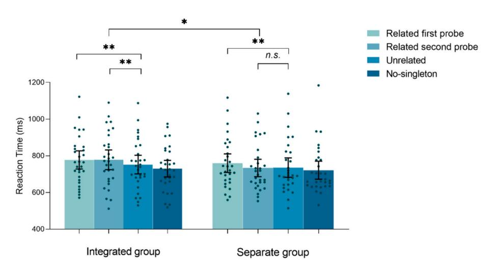
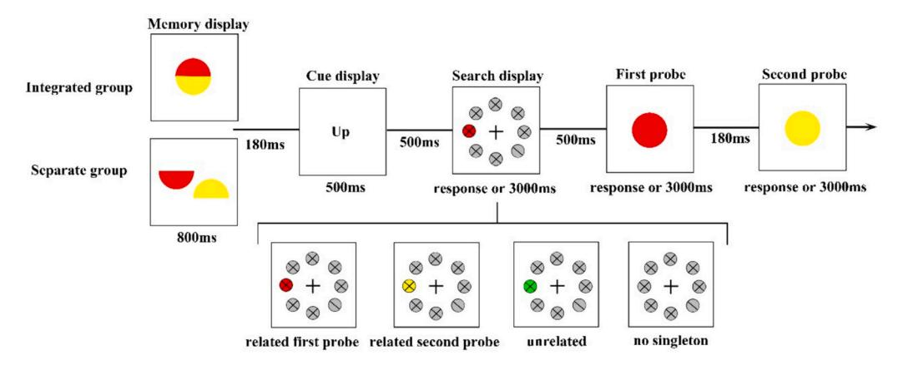
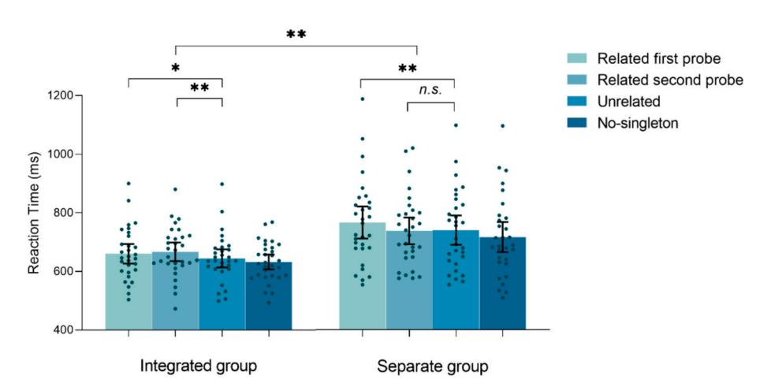
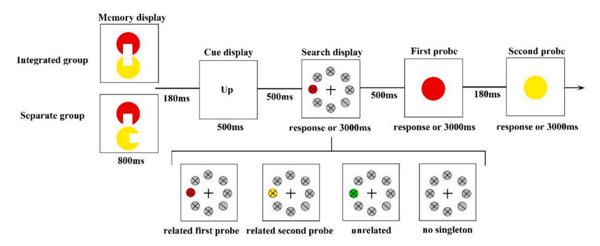
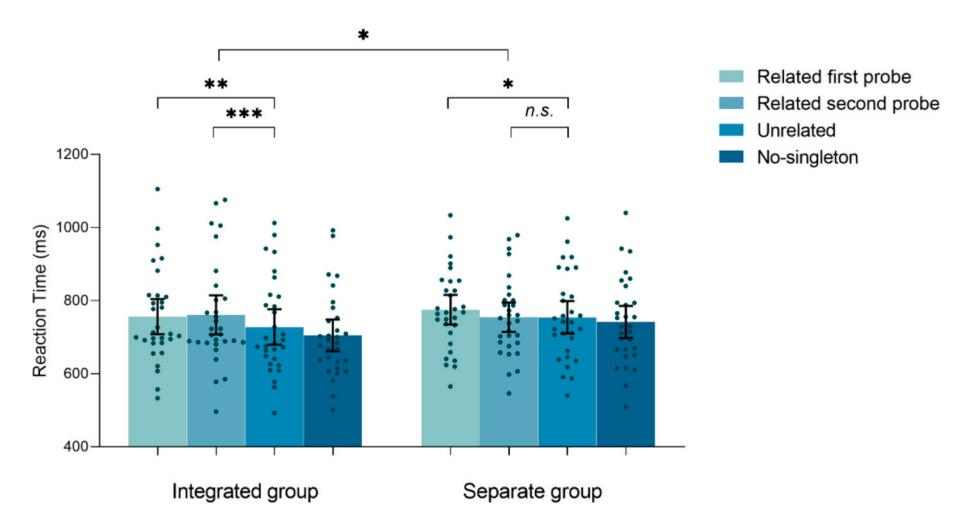

### Contents lists available at [ScienceDirect](www.sciencedirect.com/science/journal/00100277)

# Cognition

journal homepage: [www.elsevier.com/locate/cognit](https://www.elsevier.com/locate/cognit)

# Full Length Article

# The object as the unit for state switching in visual working memory

Shengnan Zhu a , Yongqi Li a , Yingtao Fu a , Jun Yin b,\*\*, Mowei Shen a,\* , Hui Chen a,\*

- a *Department of Psychology and Behavioral Sciences, Zhejiang University, PR China*
- b *Department of Psychology, Ningbo University, Ningbo, PR China*

### ARTICLE INFO

*Keywords:*  Visual working memory Active state Passive state Attention

#### ABSTRACT

This study aimed to determine the unit for switching representational states in visual working memory (VWM). Two opposing hypotheses were investigated: (a) the unit of switching being a feature (feature-based hypothesis), and (b) the unit of switching being an object (object-based hypothesis). Participants (*N* = 180) were instructed to hold two features from either one or two objects in their VWM. The memory-driven attentional capture effect, suggesting that actively held information in VWM can cause attention to be drawn towards matched distractors, was employed to assess representational states of the first and second probed colors (indicated by a retro-cue). The results showed that only the feature indicated to be probed first could elicit memory related capture for the condition of separate objects. Importantly, features from an integrated object could guide attention regardless of the probe order. These findings were observed across three experiments involving features of different dimensions, same dimensions, or perceptual objects defined by Gestalt principles. They provide convergent evidence supporting the object-based hypothesis by indicating that features within a single object cannot exist in different states.

# **1. Introduction**

Visual working memory (VWM) is a cognitive function that enables us to store and manipulate useful information, which is crucial for supporting higher-level cognitive processes. In our daily lives, we often encounter situations where we must complete a series of tasks. VWM not only assists us in achieving our immediate objectives but also aids in planning and maintaining future goals. However, VWM has been conceptualized as a limited resource, with a capacity estimated to be up to four representations [\(Cowan, 2001](#page-7-0); Luck & [Vogel, 1997](#page-8-0)). To reconcile this limitation, the VWM system has developed a flexible mode that uses information more efficiently. Researchers have proposed a hierarchical architecture of VWM based on such flexibility ([Cowan, 2001](#page-7-0); [Oberauer,](#page-8-0)  [2002;](#page-8-0) [Olivers, Peters, Houtkamp,](#page-8-0) & Roelfsema, 2011). For example, [Olivers et al. \(2011\)](#page-8-0) proposed that representations in VWM can exist in two functionally distinct states. The highly active representations are held in the focus of attention, which are available for participation in ongoing cognitive operations (i.e., active state); while latent representations are retained in a lower privileged state for later recall (i.e., passive state). This two-state mode could minimize interference and

maintain as much useful information as possible by shielding some prospective representations from the current task.

There has been a growing body of evidence that supports the multiple state account of VWM ([Chen, Sun,](#page-7-0) & Li, 2023; [LaRocque, Lewis-](#page-7-0)[Peacock, Drysdale, Oberauer,](#page-7-0) & Postle, 2013; [Lewis-Peacock, Dry](#page-7-0)[sdale, Oberauer,](#page-7-0) & Postle, 2012; [Li, Liang,](#page-7-0) & Liu, 2021; [Rose et al., 2016](#page-8-0); [van Moorselaar, Theeuwes,](#page-8-0) & Olivers, 2014; [Wolff, Jochim, Akyürek,](#page-8-0) & [Stokes, 2017](#page-8-0); [Zhang et al., 2022\)](#page-8-0). For example, [van Moorselaar et al.](#page-8-0)  [\(2014\)](#page-8-0) employed a retro cue to signal which of the two colors held in memory would be probed initially (i.e., the active one), while the other would be the second probe (i.e., the passive one). They found that during the subsequent search task, a distractor matching the active color would capture attention, resulting in a slower response time compared to memory-unrelated colors. However, the distractor matching the passive color was unable to do so. It provided evidence for that the active and passive stimuli differed in the ability to capture attention. Additionally, the two states of WM do not occupy each other's capacity ([Li et al.,](#page-7-0)  [2021\)](#page-7-0) and the passive state of WM is unable to elicit contralateral delay activity (CDA), which could track the number of visual representations stored in the online state of WM [\(Zhang et al., 2022\)](#page-8-0). Moreover, active

*E-mail addresses:* [yinjun1@nbu.edu.cn](mailto:yinjun1@nbu.edu.cn) (J. Yin), [mwshen@zju.edu.cn](mailto:mwshen@zju.edu.cn) (M. Shen), [chenhui@zju.edu.cn](mailto:chenhui@zju.edu.cn) (H. Chen).

\* Corresponding authors at: Department of Psychology and Behavioral Sciences, Zhejiang University, Zijingang Campus, 866 Yuhangtang Road, Hangzhou, PR China.

\*\* Corresponding author.

and passive items differ at the level of the responsivity of a neuronal ensemble. Active items are represented through patterns of firing across populations of neurons, while passive items are represented by shortterm potentiation of synaptic connectivity in the neuronal population ([Erickson, Maramara,](#page-7-0) & Lisman, 2010; [Mongillo, Barak,](#page-8-0) & Tsodyks, [2008; Sugase-Miyamoto, Liu, Wiener, Optican,](#page-8-0) & Richmond, 2008).

The findings above provide converging evidence for the existence of two distinct states in VWM, with active and passive representations exhibiting distinct characteristics. However, previous studies have typically examined the states of VWM representations at the object level, where active and passive states are identified as distinct objects (e.g., two-colored circles located on opposite sides of the screen center, [van](#page-8-0)  [Moorselaar et al., 2014\)](#page-8-0). This leaves open the possibility that whether representations of different features within a single object can also exist in different states, which is a crucial question regarding the unit for state switching within VWM. Specifically, if individual features serve as the unit for state switching, then we would expect to observe different features within the same object being represented in different states. Conversely, if all features must be represented in the same state, it suggests a different organizational principle. Answering this question holds significant implications for understanding how VWM is structured, as previous studies have predominantly examined scenarios where all stimuli are represented within a single state (i.e., active state) (Fougnie & [Alvarez, 2011](#page-7-0); Luck & [Vogel, 1997; Shen, Tang, Wu, Shui,](#page-8-0) & [Gao, 2013](#page-8-0); [Vogel, Woodman,](#page-8-0) & Luck, 2001; [Xu, 2002\)](#page-8-0). However, it is unclear how representations of different states are organized in VWM, a gap that could enhance our understanding of the organization of VWM. Thus, the current study aimed to directly exploring the unit for state switching by testing two opposing hypotheses.

The first hypothesis is that distinct features within a single object could exist in different states. This hypothesis is potentially valid, as some previous studies have discovered different features within an object were processed and stored independently ([Chen, Carlson,](#page-7-0) & Wyble, [2018;](#page-7-0) Chen & [Wyble, 2015](#page-7-0); Delvenne & [Bruyer, 2004;](#page-7-0) [Fougnie](#page-7-0) & [Alvarez, 2011](#page-7-0); [Huang, 2020](#page-7-0); [Huang, Treisman,](#page-7-0) & Pashler, 2007; [Mag](#page-8-0)[nussen, Greenlee,](#page-8-0) & Thomas, 1996; Olivers, Meijer, & [Theeuwes, 2006](#page-8-0); Parra, Cubelli, & [Della Sala, 2011;](#page-8-0) [Wang, Cao, Theeuwes, Olivers,](#page-8-0) & [Wang, 2017; Xu, 2002](#page-8-0)). For instance, [Fougnie and Alvarez \(2011\)](#page-7-0) found a lack of correlation between the error rates of color and orientation within the same object. [Xu \(2002\)](#page-8-0) found that the performance of VWM was similar for two colors from a bicolor object and two colors from separate objects, but worse than that for a single color alone. This finding revealed that the number of features in the same dimension, rather than the number of objects, significantly influenced both the general VWM capacity and the ability to retrieve stored information. Additionally, since there is a significant overlap in the definition and brain areas associated with attention and VWM [\(Labar, Gitelman, Par](#page-7-0)rish, & [Mesulam, 1999\)](#page-7-0), certain studies focusing on attention or exploring the interaction between VWM and attention also offer some supporting evidence for the feature-based hypothesis ([Olivers et al.,](#page-8-0)  [2006;](#page-8-0) Thayer, Bahle, & [Hollingworth, 2021\)](#page-8-0). For example, [Olivers et al.](#page-8-0)  [\(2006\)](#page-8-0) presented people with a colored shape and let them remember either color or shape. The memory-related distractor effect occurred for features that were relevant to the memory task but not for irrelevant features of the same object. To sum up, the independent processing and storage of different features make it possible for them to be separated in terms of their states.

On the other hand, it is plausible that various features of an object cannot exist in different states. This idea stems from the object-based theories, which argue that diverse features of an object are encoded and maintained in an integrated manner [\(Gao et al., 2016;](#page-7-0) [Hyun,](#page-7-0)  [Woodman, Vogel, Hollingworth,](#page-7-0) & Luck, 2009; Lee & [Chun, 2001;](#page-7-0) [Luck](#page-8-0)  & [Vogel, 1997](#page-8-0); [Shen et al., 2013;](#page-8-0) [Vogel et al., 2001](#page-8-0); [Yin et al., 2012](#page-8-0)). The irrelevant-change distracting effect provides evidence in support of this theory [\(Hyun et al., 2009](#page-7-0); [Shen et al., 2013;](#page-8-0) [Yin et al., 2012](#page-8-0)). In a typical experiment of this effect, participants were presented with two

differently colored shapes and instructed to remember the shape while ignoring the color. Later, they were asked to identify any changes in shape between the memorized and test displays. The results indicated that changes in color significantly impaired the performance of detecting changes in shape, thus implying that the representations in VWM may be associated with the object itself. Furthermore, studies focused on attention have presented robust evidence supporting object-based theories. These investigations have identified the classical same-object advantage (SOA) effect, which consistently demonstrates that participants exhibit faster and/or more accurate responses when dealing with stimuli or features from the same object compared to those from different objects ([Blaser, Pylyshyn,](#page-7-0) & Holcombe, 2000; [Cavanagh et al.,](#page-7-0)  [2023;](#page-7-0) Chen & [Huang, 2015](#page-7-0); [Duncan, 1984;](#page-7-0) O'[Craven, Downing,](#page-8-0) & [Kanwisher, 1999\)](#page-8-0). These findings raise the possibility that all features of an object might be necessarily stored at the same activation level.

We utilized a modified version of the VWM-driven attentional capture paradigm ([Downing, 2000](#page-7-0); [Olivers et al., 2006;](#page-8-0) [Soto, Heinke,](#page-8-0)  Humphreys, & [Blanco, 2005;](#page-8-0) Woodman & [Luck, 2007](#page-8-0)) to investigate the two hypotheses mentioned above. Participants were asked to retain certain information, such as two colors or a color and a shape of an object, in their VWM and then complete a visual search task which involved occasional distractors containing information (i.e., color) matching their memory. To manipulate the state, we employed a retrocue that indicated the order of the memory probe for these features. Importantly, we manipulated the perceptual organization (objecthood), of the memorized features, specifically, whether the two different features originated from a single integrated object or two separate objects.

Regarding the case of two features from separate objects, we anticipate that our findings will align with previous research indicating that only the first probed feature could capture attention. In the case of two features from an integrated object, which is the main focus of our study, we predict that if features within a single object can adopt different states, only the first probed feature will result in an attentional capture effect. Conversely, if the alternative hypothesis is true, we would expect an attentional capture effect for both the first and second probed features.

# **2. Experiment 1**

The first experiment assessed whether two different features (color and shape) from a single object could be retained as distinct states (active vs passive states).

# *2.1. Methods*

# *2.1.1. Participants*

We performed a priori power analysis using G\*Power 3.1 [\(Faul,](#page-7-0)  [Erdfelder, Lang,](#page-7-0) & Buchner, 2007) to estimate the appropriate number of participants. The effect size (dz) was estimated to be 0.58 according to the previous study which also used a similar working memory-driven attentional capture paradigm ([Fu, Zhou, Zhou, Shen,](#page-7-0) & Chen, 2021). The power calculation yielded an estimated minimum of 26 participants to detect the memory-driven attentional capture effect with 80% power (with α set to 0.05). Moreover, in order to detect the interaction effect between the integrated and the separate group, the effect size (η*p* 2 ) was estimated to be 0.09 according to the previous study [\(Chen, Shen,](#page-7-0) & [Chen, 2020](#page-7-0)). The power calculation yielded an estimated minimum of 27 participants in each group to detect the interaction effect with 80% power (with α set to 0.05). To be conservative, thirty participants were tested for each group. Finally, sixty naïve Chinese students from Zhejiang University, randomly divided into two groups (integrated group: 8 males, mean age 20.00 years; separate group: 11 males, mean age 22.33 years) completed Experiment 1 for either a course credit or 15 RMB. All participants were provided informed consent, and all procedures were approved by the Institutional Review Board at the Department of Psychology and Behavioral Sciences, Zhejiang University.

### *2.1.2. Apparatus*

All experiments were programmed and executed using MATLAB software (The MathWorks; Natick, MA) with the Psychophysics Toolbox extension and presented on a 17-in. CRT monitor (100 Hz, 1024 × 768 screen resolution). Participants sat at a viewing distance of approximately 50 cm and provided their responses using a computer keyboard. The background of the display was white (RGB: 255, 255, 255).

# *2.1.3. Stimuli*

As depicted in Fig. 1, in the integrated group, the memory display contained a colored shape (4.2◦ × 4.2◦). In the separate group, there were a black shape (4.2◦ × 4.2◦) and a colored circle (4.2◦ × 4.2◦) in the upper left and lower right corners of a virtual rectangle (8.4◦ × 8.4◦) centered on the center of the screen. The color set included five different colors (RGB values = 255, 0, 0 [red]; 0, 255, 0 [green]; 0, 0, 255 [blue]; 255, 255, 0 [yellow] and 255 0, 255 [purple]). The shape set included five different shapes (square, diamond, trapezoid, triangle, and hexagon).

Each search display consisted of eight disks (2.94◦) equally distributed on an imaginary circle (radius = 7.59◦) centered on a fixation cross. Among these disks, one served as the target and featured a single line tilted at 45◦ (either left or right). The remaining disks were gray (RGB = 192, 192, 192) distractors, each containing a black (RGB = 0, 0, 0) "X". Two memory probe displays appeared sequentially, and each contains a single object (a black shape or a colored circle).

## *2.1.4. Procedure and design*

As depicted in Fig. 1, each trial commenced with a 500 ms fixation display, succeeded by an 800 ms memory display. In the integrated group, participants were tasked with memorizing both the color and shape of a single object. Meanwhile, in the separate group, they were directed to memorize the shape of the black stimulus and the color of the circle. Following a 180 ms blank screen, one of the memory features (shape or color) was cued using 500 ms Chinese characters, indicating which feature would be probed first. After a 500 ms blank screen, the search display materialized until a response or 3000 ms had transpired. Participants were instructed to search among seven distractor disks to locate the target disk and determine whether the line within it tilted to the left or right. They were explicitly advised to perform this task swiftly and accurately, utilizing their right hand to press the appropriate arrow key (left or right). In 3/4 of the trials, the search display featured a color singleton distractor, matching the color representation in memory for the first probe (i.e., *related to the first memory probe*), matching the color representation in memory for the second probe (i.e., *related to the second memory probe*), or presenting a novel color (i.e., *unrelated*). In the remaining 1/4 of no-singleton distractor trials, all distractors were gray. The color was used as distractors but not the shape because the color attribute had relative stable effects for attention guidance than the shape attribute ([Soto et al., 2005;](#page-8-0) Wolfe & [Horowitz, 2004](#page-8-0)).

Following the completion of the search task, a blank screen was presented for a duration of 500 ms. Subsequently, two successive memory probe displays appeared, with a 180 ms interval between them. Both probe displays remained on the screen until a response was made or until 3000 ms had passed. Each probe item had the same feature as those in the memory display in half the trials and different ones in the other half. Participants had to indicate whether the feature in each probe display were identical to the memory display, by pressing "S" if they were identical or "D" if they differed with their left hands.

Participants in each group completed a practice block of 12 trials and 3 experimental blocks of 48 trials each: 36 *related to first memory probe*  trials, 36 *related to second memory probe* trials, 36 *unrelated* trials, and 36 *no-singleton* trials. The trials were presented in a random order.

# *2.1.5. Data analysis*

Trials with reaction times (RTs) over 3 standard deviations on the search task (1.34%) or incorrect on either the search or memory task (8.40%) were excluded from analysis. The accuracy of the memory task in this experiment, and in following experiments, was close to ceiling accuracy, and did not differ between the integrated and separate groups (shown in Appendix).

First, we examined the performance distinction between each singleton condition and the *no-singleton* condition to show the overall performance. The mean RTs across all distractor types (*related to first memory probe, related to second memory probe, unrelated and no-singleton*) from each group were entered in a one-way repeated measures ANOVA and post-hoc *t*-test. The contrast between *unrelated* and *no-singleton*  conditions reflects the effect of the mere presence of a color singleton (bottom-up effect). The difference between *related to first/s memory probe*  and *no-singleton* conditions encompasses both top-down (i.e. VWM guidance) and bottom-up effects.

Next, we delved into the primary focus of this paper: the memorydriven attentional capture effect. As in many previous studies ([Bahle,](#page-7-0)  Beck, & [Hollingworth, 2018](#page-7-0); [Hollingworth](#page-7-0) & Beck, 2016; [Olivers et al.,](#page-8-0)  [2006;](#page-8-0) [van Moorselaar et al., 2014](#page-8-0); Woodman & [Luck, 2007\)](#page-8-0), in this

**Fig. 1.** Example sequences of a trial in Experiment 1. In Experiment 1, the procedure for both the integrated group and the separate groups remains consistent, differing only in the memorization of features from either a single object or two objects. Participants were tasked with recalling the color and shape of the memory item(s) and then completing a successive change-detection task. The cue display indicated the order of the probe during the retention interval, where participants sought out a tilted line and specified its direction. One of the distractors was either related or unrelated to the memorized color. In the two conditions associated with the memorized color, if the cue display showed "color," the distractors were labeled as "related first probe." Alternatively, if the cue display indicated "shape," the distractors were labeled as "related second probe."

S. Zhu et al. Cognition 249 (2024) 105808

analysis, the *no-singleton* condition was excluded, and the *unrelated* condition served as the baseline to subtract the bottom-up effect caused by the mere presence of a color singleton. The mean RTs from two groups were entered in a mixed-measures ANOVA, with within-subjects factors distractor type (*related to first memory probe, related to second memory probe or unrelated*) and between-subjects factors (integrated or separate). A Greenhouse-Geisser correction was applied in case of sphericity violations. To explore this interaction effect further, we conducted a one-way repeated measures ANOVA and post-hoc *t*-test for each group.

#### 2.2. Results

The main effect of distractor type was significant both in the integrated group (F (3, 87) = 11.74, p < .001,  $\eta_p^2$  = 0.288) and the separate group (F (3, 87) = 6.461, p < .001,  $\eta_p^2$  = 0.182). In the integrated group, the post-hoc t-test showed that all the singleton conditions resulted in significantly slower RTs relative to no-singleton condition (all ts > 2.214, all ps < 0.035). In the separate group, the post-hoc t-test showed that the distractor related to first memory probe resulted in significantly slower RTs relative to no-singleton condition (t (29) = 5.024, p < .001). This difference was not significant in the other two comparisons (all ts < 1.652, all ps > 0.109), although the numerical difference was in the direction expected by singleton capture. This indicates that the sole bottom-up attention capture effect seems to be delicate in the present case, aligning with the findings of Bahle et al. (2018) observed in both their Exp 1a and Exp 2.

The results of a mixed-measures ANOVA revealed a significant main effect of distractor type (F (2, 116) = 8.323, p < .001,  $\eta_p^2$  = 0.125). The main effect of group was not significant (F (1, 58) = 1.188, p = .280,  $\eta_p^2$  = 0.020). Importantly, the interaction effect between distractor type and group was significant (F (2, 116) = 3.492, p = .034,  $\eta_p^2$  = 0.057). From Fig. 2, it seems that the interaction was driven by the variation in attentional capture (slower RTs relative to the unrelated condition) of related to second memory probe condition between the two groups. To explore this interaction effect further, we conducted a one-way repeated measures ANOVA and post-hoc pairwise t-tests for each group. The results indeed supported the observations depicted in the figure.

In the integrated group (Fig. 2, left), the main effect of distractor type was significant (F (2, 58) = 6.158, p = .004,  $\eta_p^2$  = 0.175). Further paired t-test showed that the distractor matched first and matched second both resulted in significantly slower RTs relative to the unrelated condition (related to first memory probe vs. unrelated: 778 ms vs. 752 ms, 95% CI [0.007, 0.044], t (29) = 2.792, p = .009, Cohen's d = 0.510; related to second memory probe vs. unrelated: 778 ms vs. 752 ms, 95% CI [0.010,

0.043], t(29) = 3.361, p = .002, Cohen's d = 0.614).

In the separate group (Fig. 2, right), the main effect of distractor type ( $F(2,58)=5.642, p=.006, \eta_p^2=0.163$ ) was significant. Further paired t-test showed that the distractor matched first resulted in significantly slower RTs relative to the unrelated condition (748 ms vs. 725 ms, 95% CI [0.009, 0.037], t (29) = 3.326, p = .002, Cohen's d = 0.607), but completely absent in the related to second memory probe condition (723 ms vs. 725 ms, 95% CI [-0.022, 0.018], t (29) = -0.208, p = .837, Cohen's d = -0.038, BF10 = 0.198).

In Experiment 1, we found that when the color and shape were from separate objects, only the color probed first guided attention, which was consistent with previous studies (van Moorselaar et al., 2014). More importantly, we found that when the color and shape belonged to a single object, the color was able to guide attention regardless of whether it was probed firstly or secondly. These findings suggested that different features within a single object could not be in distinct states.

#### 3. Experiment 2

Prior research has indicated that disparate features are more likely to be encoded as a unified object when they originate from distinct dimensions (e.g., color and shape), rather than when they are from the same dimension (e.g., two differnet colors, Delvenne & Bruyer, 2004; Huang, 2020; Parra et al., 2011; Wang et al., 2017; Xu, 2002). Consequently, it is plausible that same-dimension features of an object could be represented in different states. This experiment was designed to directly examine this possibility.

#### 3.1. Methods

Sixty naïve Chinese students from Zhejiang University, randomly divided into two groups (integrated group: 9 males, mean age 21.08 years; separate group: 13 males, mean age 19.75 years) completed Experiment 2. This experiment was identical to Experiment 1 except for the following: As depicted in Fig. 3, in the integrated group, the memory display was a circle composed of two differently colored semicircles (radius =  $2.1^{\circ}$ ). In the separate group, the memory items were two separated colored semicircles. Participants were given instructions to remember the two colors. Each probe contains a colored circle. Additionally, the cue indicating the order of the probes was presented as a Chinese character: up or down.

#### 3.2. Results

Data analysis was the same as Experiment 1; thus, 1.10% and 7.34%

Fig. 2. Mean search RT results for Experiment 1. \*\* p < .01. n.s. = not significant. Error bars represent 95 confidence intervals.

S. Zhu et al. Cognition 249 (2024) 105808

Fig. 3. Example sequences of a trial in Experiment 2.

of trials were excluded from analysis due to RTs outliers and response errors, respectively.

The main effect of distractor type was significant both in the integrated group (F (3, 87) = 8.645, p < .001,  $\eta_p^2$  = 0.230) and the separate group (F (3, 87) = 9.441, p < .001,  $\eta_p^2$  = 0.246). In the integrated group, the post-hoc t-test showed that the distractor related to first and second memory probe resulted in significantly slower RTs relative to nosingleton condition (all ts > 3.320, all ps < 0.002). This difference was not significant when comparing unrelated and no-singleton condition (t (29) = 1.709, p = .098), although the numerical difference was in the direction expected by singleton capture. In the separate group, all the singleton conditions resulted in significantly slower RTs relative to no-singleton condition (all ts > 2.211, all ps < 0.035).

The results of mixed-measures ANOVA showed that the main effects of distractor type (F (2, 116) = 6.777, p = .002,  $\eta_p^2$  = 0.105) and group were significant (F (1, 58) = 10.267, p = .002,  $\eta_p^2$  = 0.150). Importantly, the interaction effect between distractor type and group was significant (F (2, 116) = 5.028, p = .008,  $\eta_p^2$  = 0.080). From Fig. 4, it seems that the interaction was driven by the variation in attentional capture (slower RTs relative to the unrelated condition) of related to second memory probe condition between the two groups. To explore this interaction effect further, we conducted a one-way repeated measures ANOVA and post-hoc pairwise t-tests for each group. The results indeed supported the observations depicted in the figure.

In the integrated group (Fig. 4, left), the main effect of distractor type was significant ( $F(2, 58) = 4.987, p = .010, \eta_p^2 = 0.147$ ). Further paired t-test showed that the distractor matched first and matched second both resulted in significantly slower RTs relative to the unrelated condition (related to first memory probe vs. unrelated: 660 ms vs. 644 ms, 95% CI

[0.003, 0.029], t (29) = 2.524, p = .017, Cohen's d = 0.461; r elated to second memory probe vs. u unrelated: 666 ms vs. 644 ms, 95% CI [0.006, 0.038], t (29) = 2.853, p = .008, Cohen's d = 0.521).

In the separate group (Fig. 4, right), the main effect of distractor type (F (2, 58) = 6.528, p = .003,  $\eta_p^2$  = 0.184) was significant. Further paired t-test showed that the distractor matched first resulted in significantly slower RTs relative to the unrelated condition (766 ms vs. 740 ms, 95% CI [0.008, 0.043], t (29) =3.010, p = .005, Cohen's d = 0.550), but completely absent in the related to second memory probe condition (738 ms vs. 740 ms, 95% CI [-0.019, 0.014], t (29) = -0.349, p = .729, Cohen's d = -0.064, BF10 = 0.206).

The results of Experiment 2 were in line with those of Experiment 1, indicating that different features within a single object cannot be represented in distinct states, even when they are of the same dimension.

It should be noted that the overall difference in RTs between the integrated and separate groups was significant in this experiment. However, this difference was not observed in Experiment 1. We tend to believe that this difference between the two groups may arise from random errors or potential individual differences among the participants. Importantly, the overall difference observed in groups is considered to be systematic errors, which should not impact the interactions that are the focus of our investigation.

### 4. Experiment 3

Both Experiments 1 and 2 have provide evidences for that object as the unit for state switching, regardless of features from different or same dimensions. This experiment sought to exclude the spatial difference of the memory display between the integrated and separate groups in the

Fig. 4. Mean search RT results for Experiment 2. \* p < .05. \*\* p < .05. \*\* p < .01. n.s. = not significant. Error bars represent 95 confidence intervals.

*Cognition 249 (2024) 105808 S. Zhu et al.* 

first two experiments. Here, we used pairs of disks with collinearity cues in the integrated group, which forms a virtual contour constructed by the closure cue. In the separate group, we just rotate one of the disks to break the contour and fix spatial locations. Previous studies have suggested that the isolated objects or features can be grouped into one object via such Gestalt grouping principles [\(Gao et al., 2016](#page-7-0); [Wagemans](#page-8-0)  [et al., 2012\)](#page-8-0). Thus, we expected the same pattern as in Experiments 1 and 2 would be observed. This contributes to providing additional confirmation of the findings from Experiments 1 and 2.

#### *4.1. Methods*

Sixty naïve Chinese students from Zhejiang University, randomly divided into two groups (integrated group: 13 males, mean age 22.50 years; separate group: 14 males, mean age 19.45 years) completed Experiment 3. The experimental procedure was identical to Experiment 2 except for the following: As shown in Fig. 5, during the memory display, the two colors were integrated by Gestalt principles (integrated group), or just randomly rotate one of the components 90◦ to the left or right as separate group.

### *4.2. Results*

Data analysis was the same as Experiment 1; thus, 1.40% and 7.32% of trials were excluded from analysis due to RTs outliers and response errors, respectively.

The main effect of distractor type was significant both in the integrated group (*F* (3, 87) = 11.68, *p <* .001, η*p* 2= 0.287) and the separate group (*F* (2.416, 70.074) = 5.264, *p* = .005, η*p* 2= 0.154). In the integrated group, the post-hoc *t*-test showed that all the singleton conditions resulted in significantly slower RTs relative to no-singleton condition (all *t*s *>* 2.070, all *p*s *< 0.*047)*.* In the separate group, the post-hoc t-test showed that the distractor related to first memory probe resulted in significantly slower RTs relative to no-singleton condition (*t* (29) = 3.445, *p* = .002). This difference was not significant in the other two comparisons (all *t*s *<* 1.532, all *p*s *> 0.*136), although the numerical difference was in the direction expected by singleton capture.

The results of a mixed-measures ANOVA revealed a significant main effect of distractor type (*F* (2, 116) = 8.409, *p <* .001, η*p* 2= 0.127). However, the main effect of group was not significant (*F* (1, 58) = 0.178, *p* = .674, η*p* 2= 0.003). Importantly, the interaction effect between distractor type and group was significant (*F* (2, 116) = 3.975, *p* = .021, η*p* 2 = 0.064). From [Fig. 6](#page-6-0), it seems that the interaction was driven by the variation in attentional capture (slower RTs relative to the unrelated condition) of related to second memory probe condition between the two groups. To explore this interaction effect further, we conducted a one-way repeated measures ANOVA and post-hoc pairwise *t*-tests for each group. The results indeed supported the observations depicted in the figure.

In the integrated group [\(Fig. 6](#page-6-0), left), the main effect of distractor type (*F* (2, 58) = 6.822, *p* = .002, η*p* 2= 0.190) was significant. Further paired t-test showed that the distractor matched first and matched second both resulted in significantly slower RTs relative to the unrelated condition (*related to first memory probe* vs. *unrelated*: 756 ms vs. 727 ms, 95% CI [0.009, 0.047], *t* (29) = 3.056, *p* = .005, Cohen's *d* = 0.558; *related to second memory probe* vs. *unrelated*: 761 ms vs. 727 ms, 95% CI [0.015, 0.051], *t* (29) = 3.730, *p <* .001, Cohen's *d* = 0.681).

In the separate group ([Fig. 6](#page-6-0), right), the main effect of distractor type (*F* (1.559, 45.208) = 5.108, *p* = .016, η*p* 2= 0.150) was significant. Further paired t-test showed that the distractor matched first resulted in significantly slower RTs relative to the unrelated condition (775 ms vs. 754 ms, 95% CI [0.002, 0.039], *t* (29) = 2.257, *p* = .032, Cohen's *d* = 0.412), but completely absent in the related to second memory probe condition (754 ms vs. 754 ms, 95% CI [− 0.012, 0.013], *t* (29) = 0.051, *p*  = .959, Cohen's *d* = 0.009, BF10 = 0.195).

In Experiment 3, the findings of previous experiments were replicated and extended to gestalt objects, revealing that the features within a perceptual object could not be in separate states either.

## **5. Discussion**

The aim of this study was to investigate whether different states of visual working memory (VWM) representations are exclusive to different objects or if they can also be observed within a single object across different features. To achieve this, we manipulated the objecthood of multiple VWM representations and employed a combination of a retro-cue and a WM-driven attentional capture paradigm to investigate this question. The findings of our experiments demonstrated that when the color of separate objects was probed first, it guided attention, but not when it was probed secondly. This replication of previous findings indicates that the representation that was probed secondly was typically shifted into a passive state. Importantly, we also observed a significant attentional capture effect driven by VWM for colors from an integrated object, regardless of whether they were probed firstly or secondly. This suggests that the switch in representation state in WM failed in this particular case. This effect was robust and not limited to objects with different- dimension features (shape-color in Experiments 1), but could also be extended to objects with same-dimension features (color-color in Experiments 2) and perceptual objects (gestalt object in Experiment 3). Thus, our findings provide converging evidence that multiple representations within a single object cannot be represented in different states.

This new discovery brings fresh insights into the flexible storage of information in VWM. Previous studies have consistently demonstrated

**Fig. 5.** Example sequences of a trial in Experiment 3.

*Cognition 249 (2024) 105808 S. Zhu et al.* 

**Fig. 6.** Mean search RT results for Experiment 3. \* *p <* .05. \*\* *p <* .01. \*\*\* *p <* .001. *n.s.* = not significant. Error bars represent 95 confidence intervals.

that VWM could store information as different states ([Chen et al., 2023](#page-7-0); [de Vries, van Driel, Karacaoglu,](#page-8-0) & Olivers, 2018; [LaRocque et al., 2013](#page-7-0); [Lewis-Peacock et al., 2012](#page-7-0); [Li, Liang and Liu, 2021](#page-7-0); [Rose et al., 2016](#page-8-0); [van Moorselaar, Theeuwes and Olivers, 2014](#page-8-0); [Wolff, Jochim, Akyürek](#page-8-0)  [and Stokes, 2017;](#page-8-0) [Zhang et al., 2022\)](#page-8-0). It was replicated in separate groups in the current study by using the retro cue, which demonstrated the effectiveness of this method in manipulating states. These findings reflected the flexible nature of VWM. Importantly, the current study provides novel evidence indicating a constraint for such a flexibility, by demonstrating that only information from different objects can be stored as different states but not for information from the same object. Notably, the Experiment 3 effectively addressed potential confounds arising from spatial differences between the integrated and separate groups in Experiments 1 and 2, strengthening the validity of our conclusions. It's worth noting that our study did not investigate whether spatial location could also influence the state switching of VWM similarly to objecthood. For instance, we did not explore whether two objects can switch states when spatially superimposed. We find this to be an intriguing question and believe it warrants consideration in future research endeavors.

The present study discovered that the unit for switching states in VWM is the object itself, indicating that manipulation of VWM representation states occurs at the object level, regardless of whether the features originate from the same or different dimensions. This is somewhat different with the findings regarding the VWM storage. Specifically, previous studies have explored the unit of VWM storage (Delvenne & [Bruyer, 2004](#page-7-0); Luck & [Vogel, 1997;](#page-8-0) [Xu, 2002](#page-8-0)) and found that the advantage of object-based VWM storage was only robust for different-dimension features, while it was generally absent for samedimension features (Delvenne & [Bruyer, 2004](#page-7-0); [Huang, 2020](#page-7-0); [Wang,](#page-8-0)  Xue, & [Liu, 2018](#page-8-0)). This disparity suggests that there might be distinct units for VWM storage and manipulation, at least in the current case. One possible explanation for this difference could lie in the varying roles of attention in VWM storage and manipulation. [Huang \(2010\)](#page-7-0) introduced the idea of the dissociation between "access" and "selection" in the visual attention process. Access involves limiting the amount of visual information, with each unit requiring a fixed number of representational resources. Selection, on the other hand, involves dividing all visual information into selected and unselected subsets. Crucially, [Huang \(2010\)](#page-7-0) argued that an object serves as the unit of selection but not for access. To illustrate, consider the scenario of two different colors; the storage capacity of VWM is constrained by the color information itself. Participants need to access both colors, irrespective of whether they come from the same or different objects in a VWM storage task. In contrast, state switching in VWM likely reflects the process of selecting and focusing on information, operating at the level of objects. Therefore, the current finding that state switching occurs at the object level aligns with Huang's theory.

The current study contributes to the debate on whether multiple representations in VWM can be actively maintained to guide attention simultaneously. Some studies have proposed that multiple VWM items can guide attention at once ([Bahle, Thayer, Mordkoff,](#page-7-0) & Hollingworth, [2020;](#page-7-0) Grubert & [Eimer, 2015](#page-7-0); [Hollingworth](#page-7-0) & Beck, 2016; [Zhou, Lorist,](#page-8-0)  & [Mathot,](#page-8-0) ˆ 2020), but others have indicated that only one item can guide attention (Beck & [Vickery, 2019](#page-7-0); [Olivers et al., 2011](#page-8-0); [van Moorselaar](#page-8-0)  [et al., 2014;](#page-8-0) [Williams, Brady,](#page-8-0) & Stormer, ¨ 2022). The current study suggests that the objecthood of VWM representations plays a role in their interaction with attention. Specifically, the attentional capture by two different colors encoded from one integrated object was equivalent to that of a single active color. This finding is consistent with the previous study [\(Chen et al., 2020](#page-7-0)). Furthermore, the present study demonstrated this issue from the new perspective. We discovered that once an object is fully encoded into VWM, it was challenging to maintain one feature in a passive state while keeping other features from the same object active. In other words, all features within a single object are consistently kept active as a whole and interact with attention on the object level, even after manipulating their states. However, this phenomenon was not true for features belonging to separate objects. These findings collectively suggest that the objecthood of item representations strongly influences attentional capture by VWM items, highlighting the need to consider this factor for future studies on the attentional capture of multiple items.

While the representation that is typically probed last has commonly been thought to reside in the passive state of VWM according to the twostate model ([Olivers et al., 2011\)](#page-8-0), there are other theoretical perspectives to consider. One possibility suggests that the representation probed last may actually be in an active state but with reduced levels of activation. Under this view, the current study provides evidence that features from the same objects maintain similar levels of activity, even when one of them is not immediately relevant to the ongoing task. Nevertheless, it's worth to approach this statement with caution, given the flexible and broad nature of "levels of activation". Another possibility is that such representations are stored in long-term memory (Atkinson & [Shiffrin, 1968](#page-7-0); Baddeley & [Hitch, 1994](#page-7-0)). In reality, accurately distinguishing whether the second-order item is stored in the passive state of VWM or in long-term memory using state-of-the-art behavioral or neuroscientific techniques poses a challenge. This challenge arises due to significant overlap between the two systems, including their substantial storage capacities [\(Brady, Konkle, Alvarez,](#page-7-0) & [Oliva, 2008](#page-7-0); [Oberauer, 2002](#page-8-0)) and the involvement of similar brain areas (hippocampus, HPC, (Kaminski ´ & [Rutishauser, 2020](#page-7-0); [Wang et al., 2014](#page-8-0)). Some researchers even equate "passive" with " long-term memory" (Beukers, Buschman, Cohen, & Norman, 2021). As a result, we believe it is valuable to investigate the relationship between passive representation in VWM and information stored in long-term memory in future studies.

In summary, our three experiments consistently show that features within a single object stored in VWM cannot be in separate states. This suggests that objects serve as the unit for switching states in VWM representations.

# **CRediT authorship contribution statement**

**Shengnan Zhu:** Writing – review & editing, Writing – original draft, Methodology, Investigation, Formal analysis, Data curation. **Yongqi Li:**  Writing – review & editing, Visualization, Investigation, Formal analysis. **Yingtao Fu:** Writing – original draft, Validation, Methodology. **Jun Yin:** Writing – review & editing, Writing – original draft, Validation, Conceptualization. **Mowei Shen:** Writing – original draft, Supervision, Resources, Project administration, Conceptualization. **Hui Chen:**  Writing – review & editing, Writing – original draft, Validation, Supervision, Project administration, Funding acquisition, Conceptualization.

### **Data availability**

None of the studies reported in this article was preregistered. The datasets underlying the current study are available on the Open Science Framework [\[https://osf.io/uq253/\]](https://osf.io/uq253/). The materials used in the studies have been described clearly in the article, which are simple shapes or colors.

### **Acknowledgements**

This work was supported by grants from Science and Technology Innovation 2030-"Brain Science and Brain-like Research" Major Project (No.2022ZD0210800 for H.C.), Emerging Enhancement Technology under Perspective of Humanistic Philosophy, supported by National Office for Philosophy and Social Science (No.20&ZD045 for H.C.), National Natural Science Foundation of China (No.32171046 for H.C., No.32071044 for M.S., No.32371090 for J.Y.).

### **Appendix A. Supplementary data**

Supplementary data to this article can be found online at [https://doi.](https://doi.org/10.1016/j.cognition.2024.105808)  [org/10.1016/j.cognition.2024.105808](https://doi.org/10.1016/j.cognition.2024.105808).