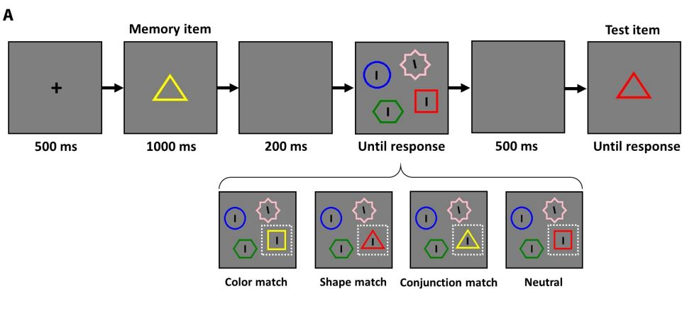
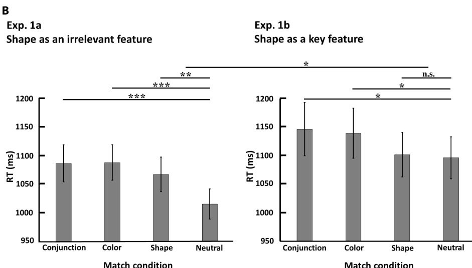
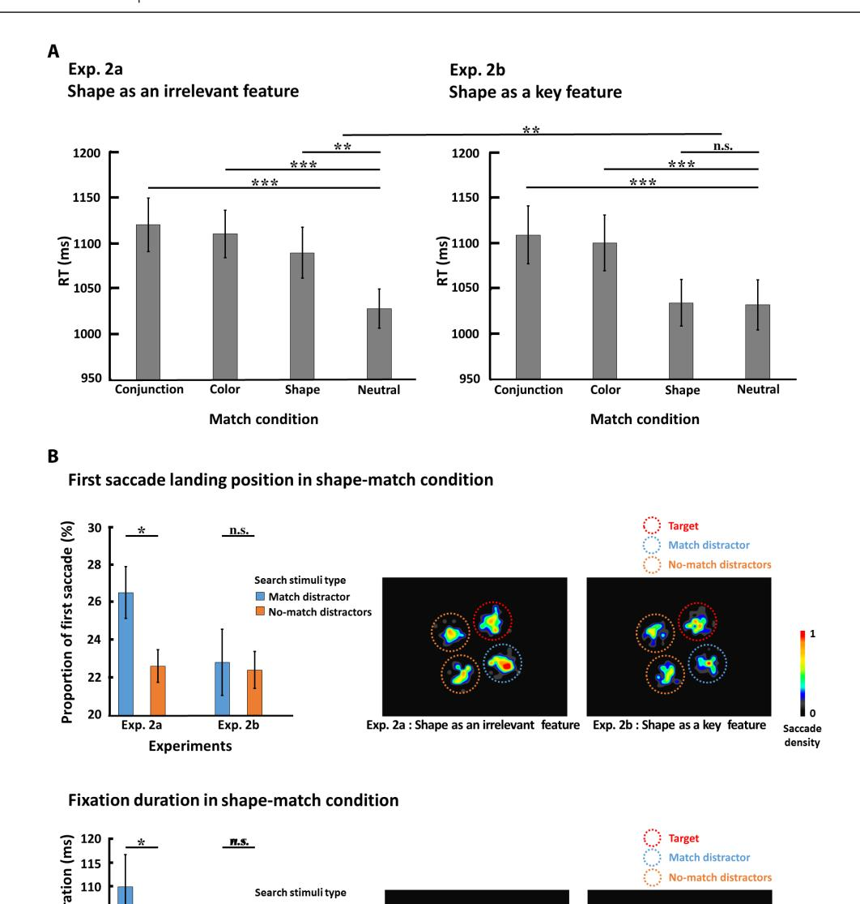
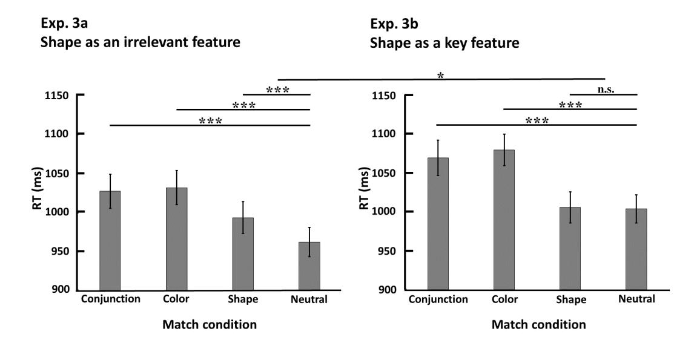
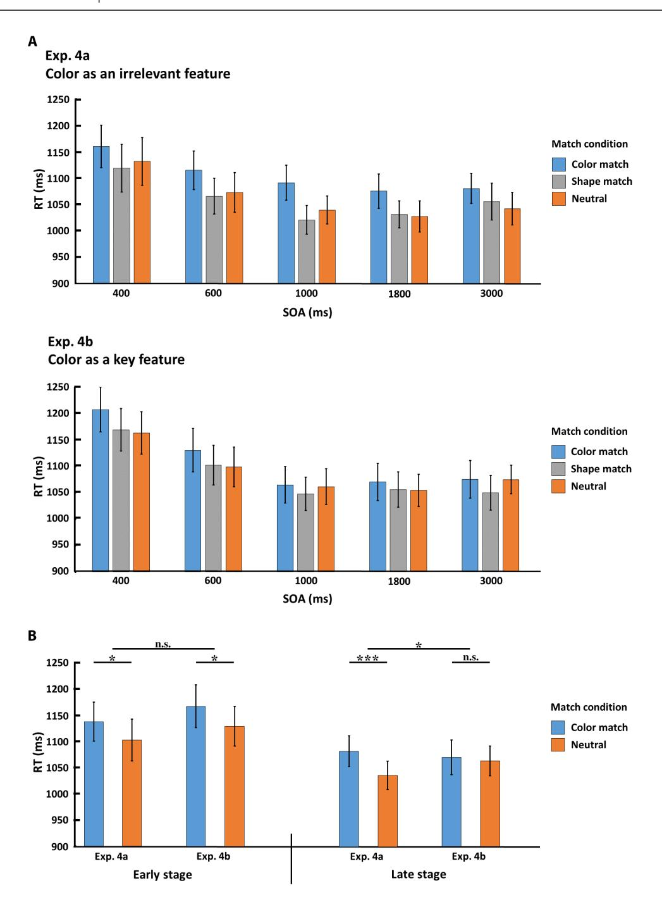
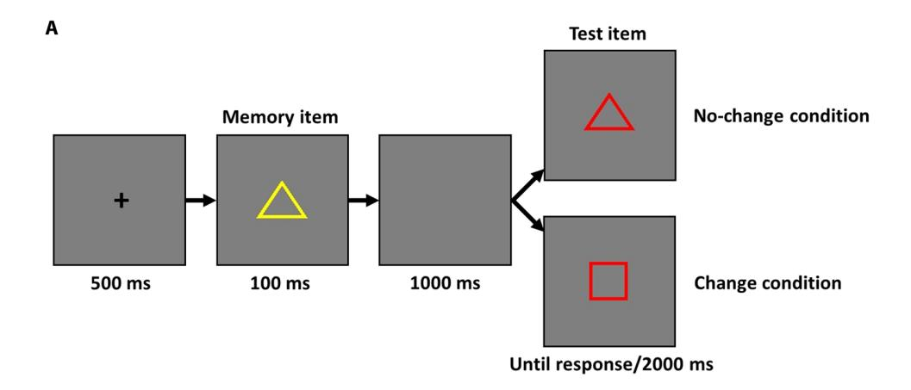
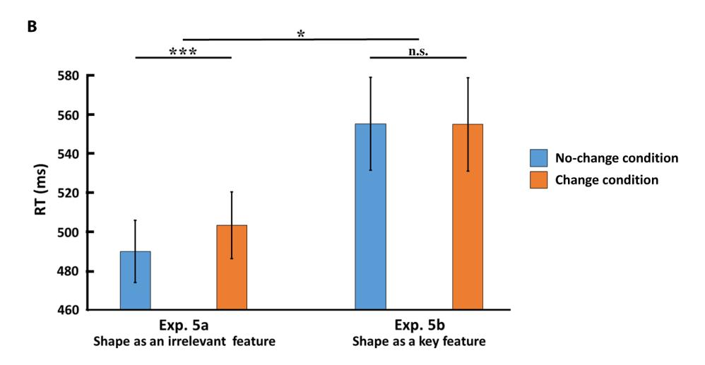
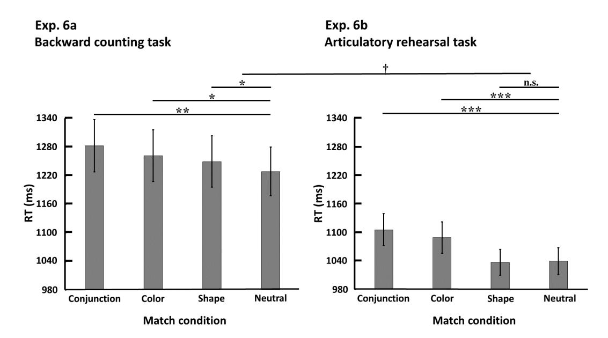

# **PSYCHOLOGICAL SCIENCE**

# **More attention with less working memory: The active inhibition of attended but outdated information**

**Yingtao Fu, Yiling Zhou, Jifan Zhou\*, Mowei Shen\*, Hui Chen\***

**Attention has traditionally been regarded as a gateway to working memory, and almost all theoretical frameworks of attention and working memory assume that individuals always have a better memory for information that has received more attention. Here, we provide a series of counterintuitive demonstrations that show that paying more attention to a piece of information impedes, rather than enhances, the selection of this information into working memory. Experiments 1 to 5 provide converging evidence for an even weaker working memory trace of fully attended but outdated features, compared with baseline irrelevant features that were completely ignored. This indicates that the brain actively inhibits attended but outdated information to prevent it from entering working memory. Experiment 6 demonstrates that this inhibition processing is subject to executive control. These findings lead to a substantial reinterpretation of the relationship between attention and working memory.**

Copyright © 2021 The Authors, some rights reserved; exclusive licensee American Association for the Advancement of Science. No claim to original U.S.Government Works. Distributed under a Creative Commons Attribution NonCommercial License 4.0 (CC BY-NC).

# **INTRODUCTION**

Research exploring the processing capability of the brain posits that our working memory can hold an extremely limited amount of information at any given time [e.g., three to four items; (*1*, *2*)]. The selection of the most relevant information into the working memory system is a fundamental ability undertaken by the brain to survive in a complex and dynamic environment (*3*, *4*). Attention has traditionally been proposed as the gateway to working memory, as it determines what information is selected into working memory (*5*–*7*).

In most studies supporting the determining role of attention in working memory selection, the attended information was also the one that was tested in the future [e.g., later report; (*8*–*16*)]. However, this is not always true in our daily life. For example, when we attempt to log into an account using a randomly generated code, sufficient attention should be paid to avoid making any mistakes. However, this code is not required for future scenarios; thus, this information becomes outdated after serving this one-time purpose. This type of attended but outdated information is relatively common in everyday life; nevertheless, it has largely been ignored in previous research. It remains unknown whether such attended information is also selected into working memory. From the perspective of efficiency, the answer should be "no," because working memory is a severely capacity-limited system that would overload if it stored outdated (although attended) information. Therefore, there should be a blocking mechanism to prevent this attended but outdated information from entering working memory. In this study, we report a series of experiments demonstrating that attended information could truly be blocked from working memory via a mechanism that actively inhibits this information from being stored. The key evidence comes from the unexpected observation that the memory trace of this attended yet outdated information is even weaker than that of totally irrelevant/ignored information at baseline. In other words, we found a counterintuitive phenomenon in

Department of Psychology and Behavioral Sciences, Zhejiang University, Hangzhou, China.

which paying more attention to a piece of information weakened working memory rather than strengthened it.

In experiment 1, we directly compared the memory traces between two types of features: key features, which refer to the information that participants have to attend to and use to perform a task but do not need to report eventually (i.e., attended but outdated information) (*17*, *18*), and irrelevant features, which are defined as totally task-irrelevant information throughout the whole task that participants should ignore. The results showed that the memory trace of the shape of a stimulus (e.g., triangle) was stronger when it served as an irrelevant feature (experiment 1a) than when it served as a key feature (experiment 1b), as indicated by the greater memorydriven attentional bias triggered by the former than the latter. Actually, we only found a remarkable memory-driven attentional bias triggered by the irrelevant features, but almost no bias triggered by the attended key features. Critically, the stimuli of to-be-compared features (irrelevant and key features) in experiments 1a and 1b were identical; the only difference (which was defined through instruction) was the task relevance (i.e., completely task-irrelevant features that should be ignored versus key features that should be attended at least initially).

Experiment 2 replicated experiment 1 and provided further supporting evidence from eye movements. Experiment 3 further confirmed previous findings with a larger sample size. Experiment 4 extended these findings in two crucial aspects. First, the observed effect could also be generalized to color. Second, the time course of the effect was systematically examined by setting different stimulus onset asynchronies (SOAs); we found that this effect appeared only with long SOAs, not with short SOAs. Experiment 5 generalized these findings by adopting another well-accepted irrelevant-distracting paradigm to probe the working memory trace and consistently showed stronger memory traces for irrelevant features than for key features. Experiment 6 showed that the memory traces of key features became stronger when executive control was consumed by another task. This was demonstrated by the fact that a memory-driven attentional bias was observed even for key features when participants were given a simultaneous backward counting task (experiment 6a) but not when they were given another articulatory rehearsal task (experiment 6b). In summary, the present study provides converging

\*Corresponding author. Email: [chenhui@zju.edu.cn](mailto:chenhui@zju.edu.cn) (H.C.); [jifanzhou@zju.edu.cn](mailto:jifanzhou@zju.edu.cn) (J.Z.); [mwshen@zju.edu.cn](mailto:mwshen@zju.edu.cn) (M.S.)

evidence that our brain tends to actively inhibit attended but outdated information (key features) by pushing it down to an extent even below the irrelevant features.

## **RESULTS**

# **Experiments 1a and 1b**

Experiment 1 compared the memory traces of the key features and irrelevant features by testing the working memory-driven attentional bias effects triggered by these two types of features—an effect showing automatic attentional bias to the items held in working memory (19, 20). We adopted this effect to reflect memory traces because such an effect can only be driven by active working memory representations; moreover, no such effect is observed with passive viewing alone or when the encoded item is released from working memory (19, 21). Furthermore, recent studies have demonstrated that this effect can be used to decode working memory contents effectively (22, 23).

In experiment 1a (see Fig. 1A), in each trial, the memory display contained a central colored shape (e.g., a yellow triangle) and was presented for 1000 ms. Participants were asked to only memorize its color while ignoring its shape (i.e., shape was a task-irrelevant feature). In the latter memory test, participants were required to judge whether the color of the test item was the same as the memorized one (while the shape of the test item was always the same as the memory item). During the memory maintenance phase, there was a search display where three distractor lines (vertical lines) and one target line (tilted line) were embedded in four distinct colored shapes that were evenly distributed over an invisible circle. Participants needed to find the tilted target line as quickly and accurately as possible and indicated whether the line tilted to the left or right. There were four memory-match conditions in the search task, which were defined by how the memory item matched one of the distractor stimuli in the search display. Specifically, one of the three distractor stimuli in the search display shared color, shape, both color and shape, or neither feature with the memory item, which were named as color-match condition, shape-match condition, conjunction-match condition, and neutral condition, respectively. Many previous studies demonstrated that if a distractor in a visual search task shares some information (e.g., color or shape) with the item held in visual working memory, it would automatically attract participants' attention and thus prolong search time (19–23).

Experiment 1b was identical to experiment 1a except that in the memory display, participants needed to judge whether the memory item was a circle at first. Only if it was not a circle should they memorize and report its color, as in experiment 1a (i.e., not-circle trials). This made shape a key feature as it determined how attention should be triggered but was not itself necessary to be stored in memory. Apart from these not-circle trials, there were a small number of trials (~20%) wherein the memory display contained a circle, and participants were not required to remember the color. These trials served as catch trials and were thus not included in the analyses. Note that for not-circle trials, the experimental procedure was exactly the same as experiment 1a, with the only difference (manipulated through using different task instructions) being that shape was a key feature that had to be attended and used for performing the task rather than a completely task-irrelevant feature as in experiment 1a.

Preliminary analyses showed that the accuracy results of the search task in all experiments were close to ceiling (>98%); thus, we only

focused on the analyses regarding the search times in different conditions. For experiment 1a (shape as an irrelevant feature; see Fig. 1B), a one-way repeated-measures analysis of variance (ANOVA) yielded a significant main effect of match condition ( $F_{2.145,62.210} = 7.195$ , P = 0.001,  $\eta_p^2 = 0.199$ ). Post hoc contrasts revealed that the search time was significantly faster in the neutral condition than in both the conjunction-match condition [mean difference (MD) = 71 ms; 95% confidence interval (CI), 45 to 97;  $t_{29} = 5.582$ ; P < 0.001; Cohen's d = 1.019] and color-match condition (MD = 72 ms; 95% CI, 42 to 102;  $t_{29} = 4.912$ ; P < 0.001; Cohen's d = 0.897). Critically, we found that the search time was also significantly faster in the neutral condition than in the shape-match condition (MD = 52 ms; 95% CI, 14 to 89;  $t_{29} = 2.798$ ; P = 0.009; Cohen's d = 0.511). This result indicated that the task-irrelevant shape produced a memory-driven attentional bias, which was consistent with previous findings (24). For experiment 1b (shape as a key feature; see Fig. 1B), the results also showed a significant main effect of match condition ( $F_{2.394,69.440}$  = 3.245, P = 0.037,  $\eta_p^2 = 0.101$ ). Post hoc contrasts revealed that the search time was significantly faster in the neutral condition than in both the conjunction-match (MD = 50 ms; 95% CI, 3 to 98;  $t_{29}$  = 2.173; P = 0.038; Cohen's d = 0.397) and color-match condition (MD = 43 ms; 95% CI, 2 to 84;  $t_{29}$  = 2.135; P = 0.041; Cohen's d = 0.390). However, unlike in experiment 1a, the search time was not significantly different between the neutral condition and the shape-match condition (MD = 5 ms; 95% CI, -22 to 33;  $t_{29} = 0.411$ ; P = 0.684; Cohen's d = 0.075; BF01 = 4.756). This indicated that the key feature (i.e., shape) did not produce a significant memory-driven attentional bias effect. Furthermore, the between-experiment comparison showed that the memory-driven attentional bias effect of the shape significantly differed between experiments 1a and 1b ( $F_{1,58} = 4.128$ , P = 0.047,  $\eta_p^2 = 0.066$ ). There was no significant difference for the memory-driven attentional bias effect of color ( $F_{1.58} = 1.370$ , P = 0.247,  $\eta_p^2 = 0.023$ , BF01 = 2.148) or the color-shape conjunction ( $F_{1,58} = 0.599$ , P = 0.442,  $\eta_p^2 = 0.010$ ,  $BF_{01} = 2.963$ ) between

The results of experiments 1a and 1b showed a significant memory-driven attentional bias for the shape of a stimulus when it served as an irrelevant feature, but not when it served as a key feature. Such a bias effect of the irrelevant feature was significantly larger than that of the key feature. Note that as a key feature, the shape of a stimulus was necessary for the task, and thus, participants had to pay attention to it, whereas as an irrelevant feature, the exact same shape of the stimulus should be selectively ignored. Thus, it is reasonable to assume that more attention was directed to a key feature, at least initially, according to many studies of feature-selective attention (25–27). Accordingly, the notable findings of experiments 1a and 1b revealed a case in which paying more attention to particular information impeded, rather than enhanced, the selection of this information into working memory.

# Experiments 2a and 2b

Experiments 2a and 2b were designed to replicate and generalize the above findings by replicating experiments 1a and 1b, respectively, and simultaneously tracking participants' eye movements during experiments, as previous studies revealed that participants' eye movements would be involuntarily biased to the working memorymatch information in a visual search (21, 28). The procedures of experiments 2a and 2b were exactly the same as experiments 1a and 1b, except that participants' eye movement data were recorded.

**Fig. 1. Task procedure and results of experiments 1a and 1b.** (**A**) In experiment 1a, participants were asked to remember the color of the memory item and complete a change-detection task in the test (here, the color changed). In the retention interval, they searched for a tilted line and specified its direction. One of the distractors could match the color, shape, both color and shape, or neither feature with the memory item. Experiment 1b was identical to experiment 1a except that in the memory display, participants needed to judge whether the memory item was a circle at first. Only if it was not a circle should they memorize its color. (**B**) The visual search results [reaction time (RT)] of four match conditions in experiments 1a (left part) and 1b (right part). Error bars represent SEM. \*P < 0.01, and \*\*\*P < 0.001; n.s., not significant.

The behavioral results completely replicated experiments 1a and 1b (see Fig. 2A). For search time in experiment 2a (i.e., the shape served as an irrelevant feature), there was a significant main effect of match condition ( $F_{3,87} = 10.444$ , P < 0.001,  $\eta_p^2 = 0.265$ ). Post hoc contrasts revealed that the search time was significantly faster in the neutral condition than in both the conjunction-match condition (MD = 92 ms; 95% CI, 59 to 125;  $t_{29} = 5.715$ ; P < 0.001; Cohen's d = 1.043) and color-match condition (MD = 82 ms; 95% CI, 51 to 112;  $t_{29} = 5.519$ ; P < 0.001; Cohen's d = 1.008). Critically, the search time was also significantly faster in the neutral condition than in the shape-match condition (MD = 61 ms; 95% CI, 28 to 95;  $t_{29}$  = 3.731; P = 0.001; Cohen's d = 0.681). This indicated that the task-irrelevant shape produced a memory-driven attentional bias, which replicated the results of experiment 1a. For search time in experiment 2b (i.e., the shape served as a key feature), there was also a significant main effect of match condition ( $F_{3,87} = 12.537$ , P < 0.001,  $\eta_p^2 = 0.302$ ). Post hoc contrasts revealed that the search time was significantly faster in the neutral condition than in both the conjunction-match (MD = 77 ms; 95% CI, 43 to 111;  $t_{29}$  = 4.621; P < 0.001; Cohen's d = 0.844) and color-match condition (MD = 68 ms; 95% CI, 37 to 99;  $t_{29}$  = 4.480; P < 0.001; Cohen's d = 0.818). However, consistent with experiment 1b, we again found that the search time did not significantly differ between the neutral condition and the shape-match condition (MD = 2 ms; 95% CI, -24 to 28;  $t_{29}$  = 0.181; P = 0.857; Cohen's d = 0.033; BF01 = 5.066). Furthermore, the between-experiment comparison showed that the memory-driven attentional bias effect of the shape significantly differed between experiments 2a and 2b ( $F_{1,58}$  = 8.035, P = 0.006,  $\eta_p^2$  = 0.122), whereas there was no significant difference for the memory-driven attentional bias effect of the color ( $F_{1,58}$  = 0.412, P = 0.523,  $\eta_p^2$  = 0.007, BF01 = 3.205) or the color-shape conjunction ( $F_{1,58}$  = 0.415, P = 0.522,  $\eta_p^2$  = 0.007, BF01 = 3.200).

The eye movement data were consistent with the behavioral results within each experiment. As shown in Fig. 2B, in experiment 2a, as expected, participants' eye movements were biased to the shape-match distractor in visual search. This was supported by a significantly greater proportion of first saccade landing (MD = 4%;

**Fig. 2. Results of experiments 2a and 2b.** (**A**) The visual search results (RT) of four match conditions in experiments 2a (left part) and 2b (right part). (**B**) The eye movement results from the visual search phase of shape-match condition in experiments 2a and 2b. The proportion of first saccade landing (upper part) and overall fixation duration (lower part) on different distractor types (match and no-match distractors) are shown in histograms. For no-match distractors, data were the average of the two distractors. The heatmaps demonstrate the density of first saccade landing (upper part) or fixation duration (lower part) in an example display type, where the shapematch distractor was 90° clockwise relative to the target location. Data from each trial in this display type were rotated as if the target location was on the top right. All heatmaps were smoothed by a Gaussian filter (*50*); the kernel size was set at 5, while the SD (sigma) was set at 3. Error bars represent SEM. \**P <* 0.05, \*\**P <* 0.01, and \*\*\**P <* 0.001.

95% CI, 0 to 8; *t*29 = 2.165; *P =* 0.039; Cohen's *d* = 0.395) as well as longer overall fixation duration (MD = 12 ms; 95% CI, 1 to 24; *t*29 = 2.139; *P =* 0.041; Cohen's *d* = 0.390) on the shape-matching distractor than the other two no-match distractors in the shapematch condition. However, in experiment 2b, this memory-driven bias of eye movements was absent, as there was no significant difference between the proportion of first saccade landing (MD < 1%; 95% CI, −4 to 5; *t*29 = 0.179; *P =* 0.859; Cohen's *d* = 0.033; BF01 = 5.068) or overall fixation duration time (MD = 2 ms; 95% CI, −8 to 11; *t*29 = 0.345; *P =* 0.733; Cohen's *d* = 0.063; BF01 = 4.868) on the shape-matching distractor and the other two no-match distractors in the shape-match condition. The between-experiment comparison did not reach significance either for the proportion of first saccade landing (*F*1,58 = 1.424, *P =* 0.238, p 2 = 0.024, BF01 = 2.100) or for overall fixation duration time ( $F_{1,58} = 2.060$ , P = 0.157,  $\eta_p^2 = 0.034$ , BF01 = 1.613) in the shape-match distractor in experiments 2a and 2b. Thus, the results of eye movements provided supporting evidence for behavioral data within each experiment, although they did not yield a significant between-experiment interaction.

# **Experiments 3a and 3b**

In the first two experiments, we found consistent results showing a significant difference between experiments in the memory-driven attentional bias effect for the irrelevant/key feature (i.e., shape), but not for the response feature (i.e., color). Notably, to provide stronger evidence that the reduction in the memory-driven attentional bias was specific for key shape, but not for response color, we need to demonstrate that there was a statistical difference between the shape and color (thanks for this suggestion from an anonymous reviewer). Unfortunately, the previous two experiments did not have sufficient statistical power to test it because the sample size was determined without considering such an interaction. Thus, here we conducted replication experiments based on experiments 1a and 1b, with the only exception that the sample size was doubled in each experiment.

As shown in Fig. 3, the results of experiments 3a and 3b replicated the first two experiments. When shape served as an irrelevant feature in experiment 3a, there was a significant main effect of match condition ( $F_{3,177} = 21.605$ , P < 0.001,  $\eta_p^2 = 0.26$ ). Post hoc contrasts revealed that the search time was significantly faster in the neutral condition than in both the conjunction-match (MD = 65 ms; 95% CI, 46 to 84;  $t_{59} = 6.828$ ; P < 0.001; Cohen's d = 0.882) and color-match condition (MD = 69 ms; 95% CI, 52 to 87;  $t_{59}$  = 8.049; P < 0.001; Cohen's d = 1.039). Critically, the search time was also significantly faster in the neutral condition than in the shape-match condition (MD = 31 ms; 95% CI, 14 to 48;  $t_{59}$  = 3.734; P < 0.001; Cohen's d = 0.482). When shape served as a key feature in experiment 3b, there was also a significant main effect of match condition  $(F_{3,177} = 30.505, P < 0.001, \eta_p^2 = 0.341)$ . Post hoc contrasts revealed that the search time was significantly faster in the neutral condition than in both the conjunction-match condition (MD = 66 ms; 95% CI, 44 to 87;  $t_{59} = 6.169$ ; P < 0.001; Cohen's d = 0.796) and colormatch condition (MD = 76 ms; 95% CI, 58 to 94;  $t_{59}$  = 8.473; P < 0.001; Cohen's d = 1.094). However, the search time did not significantly differ between the neutral condition and the shapematch condition (MD = 2 ms; 95% CI, -16 to 20;  $t_{59}$  = 0.220; p = 0.827; Cohen's d = 0.028; BF01 = 6.918). The between-experiment comparison showed that the memory-driven attentional bias effect significantly differed between experiments for shape ( $F_{1,118} = 5.737$ , P = 0.018,  $\eta_p^2 = 0.046$ ), but not for color ( $F_{1,118} = 0.255$ , P = 0.615,  $\eta_{\rm p}^2 = 0.002$ , BF01 = 4.585) or color-shape conjunction (F1,118 = 0.004, P = 0.951,  $\eta_p^2 < 0.001$ ,  $BF_{01} = 5.136$ ). Furthermore, we carried out an interaction analysis between the experiment and match condition (color match versus shape match), with the size of the attentional bias effect as dependent variable. The results showed that the interaction reached significance ( $F_{1,118} = 5.919$ , p = 0.016,  $\eta_p^2 = 0.048$ ), indicating that the change of attentional bias effect between experiments for shape was significantly larger than that of color. This experiment not only replicated previous findings but also, critically, provided stronger evidence showing that the reduction in memorydriven attentional bias was specific for key shape but not for other features from the same object (e.g., response color).

# Experiments 4a and 4b

In experiments 4a and 4b, we sought to extend previous findings in two crucial aspects. First, we investigated whether the observed effect could be generalized to other features (e.g., color). Furthermore, we systematically examined the time course of the effect by setting different SOAs between the memory display and visual search display in this experiment.

Experiment 4a was identical to experiment 1a except for the following changes. Participants were asked to remember the size of the memory item and complete a size change-detection task at the end (both color and shape remained the same in the memory test display). To manipulate the SOAs, the memory display appeared on the screen for 100 ms, instead of 1000 ms as in previous experiments. There were five different SOAs: 400, 600, 1000, 1800, and 3000 ms.

Fig. 3. The visual search results of experiments 3a and 3b. RT of four match conditions in experiments 3a (left part) and 3b (right part). Error bars represent SEM. \*P < 0.05, \*\*\*P < 0.001.

To prevent the experiment from being too long, we removed the conjunction-match condition in the visual search task and reserved the other three match conditions (color match, shape match, and neutral). Experiment 4b was the same as experiment 4a, except that participants were asked to judge whether the color of the memory item was yellow or not at first. Only if the color was not yellow should they memorize its size and make the size judgment in the memory test. Similar to experiment 1b, there were a small number of catch trials containing a yellow memory item wherein participants were not required to remember the size. In this design, color served as an irrelevant feature in experiment 4a and as a key feature in experiment 4b.

The search time results of experiments 4a and 4b are shown in Fig. 4. For experiment 4a (color as an irrelevant feature; see Fig. 4A), the two-way repeated-measures ANOVA yielded a significant main effect of SOA ( $F_{2.486,72.082}=11.031$ , P<0.001,  $\eta_{\rm p}^2=0.276$ ), with the search time decreasing with longer SOA. A significant main effect of match condition was found ( $F_{1.636,47.433}=17.224$ , P<0.001,  $\eta_{\rm p}^2=0.373$ ). Post hoc contrasts revealed that the search time in the neutral condition was significantly faster than that in the color-match condition (MD = 42 ms; 95% CI, 26 to 58;  $t_{29}=5.279$ ; P<0.001; Cohen's d=0.964), but not the shape-match condition (MD = -4 ms; 95% CI, -19 to 11;  $t_{29}=0.579$ ; P=0.567; Cohen's d=0.106; BF $_{01}=4.407$ ). The interaction between SOA and match condition did not reach significance ( $F_{8,232}=0.455$ , P=0.887,  $\eta_{\rm p}^2=0.015$ , BF $_{01}=170.331$ ).

For experiment 4b (color as a key feature; see Fig. 4A), the results also yielded a significant main effect of SOA ( $F_{2.416,70.067} = 24.337$ , P < 0.001,  $\eta_p^2 = 0.456$ ), with search time decreasing with longer SOA. A significant main effect of match condition was found ( $F_{2.58} = 3.548$ , P = 0.035,  $\eta_p^2 = 0.109$ ). Post hoc contrasts revealed that the difference in search time between the neutral condition and the color-match condition approached significance (MD = 19 ms; 95% CI, -3 to 41;  $t_{29} = 1.781$ ; P = 0.085; Cohen's d = 0.325) and no difference between the neutral condition and shape-match condition (MD = -5 ms; 95% CI, -22 to 11;  $t_{29} = 0.691$ ; P = 0.495; Cohen's d = -0.126; BF $_{01} = 4.130$ ). The interaction between SOA and match condition did not reach significance ( $F_{5.912,171.442} = 0.527$ , P = 0.785,  $\eta_p^2 = 0.018$ , BF $_{01} = 139.226$ ).

The between-experiment comparison showed that the difference for the memory-driven attentional bias effect of the color between experiments 4a and 4b approached significance ( $F_{1,58} = 2.841$ , P = 0.097,  $\eta_p^2 = 0.047$ ). Note that this effect was relatively weaker than those in previous experiments. An inspection of Fig. 4A revealed that this is because the effect was only revealed in long SOA conditions (1000, 1800, and 3000 ms), but not in short SOA conditions (400 and 600 ms). This was supported by a separate analysis of the short versus long SOA conditions. As depicted in Fig. 4B, in short SOA conditions, the search time was significantly faster in the neutral condition than in the color-match condition both in experiment 4a (MD = 35 ms; 95% CI, 8 to 62;  $t_{29}$  = 2.645; P = 0.013; Cohen's d = 0.483) and experiment 4b (MD = 38 ms; 95% CI, 6 to 71;  $t_{29} = 2.402$ ; P = 0.023; Cohen's d = 0.439). As a contrast, in long SOA conditions, the search time was significantly faster in the neutral condition than in the color-match condition in experiment 4a (MD = 46 ms; 95% CI, 25 to 68;  $t_{29}$  = 4.372; P < 0.001; Cohen's d = 0.798), but not in experiment 4b (MD = 7 ms; 95% CI, -20 to 33;  $t_{29} = 0.515$ ; P = 0.610; Cohen's d = 0.094; BF01 = 4.550). While no significant difference was found in the memory-driven attentional bias effect between experiments 4a and 4b in short SOA conditions

 $(F_{1,58} = 0.020, P = 0.889, \eta_p^2 < 0.001, BF_{01} = 3.780)$ , a significant difference was observed in long SOA conditions ( $F_{1,58} = 5.637$ ,  $P = 0.021, \eta_p^2 = 0.089$ ).

In line with previous experiments, these results again showed that the memory trace of the irrelevant feature was stronger than the key feature, indicating that this effect could persist with different types of features (shape and color). In addition, this effect appears only at a late time period (i.e., long SOAs), but not during the early time period (i.e., short SOAs). This suggests that it takes time to inhibit the key feature successfully, particularly when the key feature was a physically salient piece of information (i.e., color). Another unexpected finding is that, in the previous two experiments, the task-irrelevant shape reliably produced a significant memory-driven attentional bias, while this effect was absent in the current experiment. This might be owing to the methodological difference between experiments, such as the presentation time of the memory display (1000 versus 100 ms) and the response feature (color versus size).

# Experiments 5a and 5b

Experiments 5a and 5b sought to investigate whether the results could be generalized to other working memory paradigms. We adopted another classical irrelevant-distracting paradigm (29–31) to probe the working memory traces of irrelevant and key features. In this paradigm, the memory array and test array are sequentially presented, and participants are required to judge whether one feature dimension (i.e., the response feature) changed in the latter, compared to the former, while ignoring other features that could also change. Critically, the change of the ignored features would impair the change-detection performance of the response feature, resulting in an irrelevant-change distracting effect.

In each trial of experiment 5a (see Fig. 5A), the memory display contained a central colored shape that was presented for 100 ms. Participants were asked to memorize its color while ignoring its shape (i.e., shape was a task-irrelevant feature). In the memory test, participants were required to judge whether the color of the test item was the same as the memorized one. In half of the trials, the shape of the test item remained the same as the memorized item (i.e., no-change condition), whereas in the other half, the test item had a different shape, compared to the memorized item (i.e., change condition). Existing studies report that if the task-irrelevant feature was automatically selected into working memory, its change would impair the change-detection performance of the response feature (i.e., it would prolong reaction time (RT) in the change than the in no-change condition (29-31). Experiment 5b was identical to experiment 5a except that in the memory display, participants were required to judge whether the memory item was a circle at first. They had to memorize its color as in experiment 5a if the shape was not a circle. This made shape a key feature.

As the accuracy results were close to the ceiling (>97%), we focused on the RT analyses, as in previous experiments. For experiment 5a (shape as an irrelevant feature; see Fig. 5B), the RT was significantly faster in the no-change than in the change condition (MD = 13 ms; 95% CI, 6 to 21;  $t_{29}$  = 3.686; P < 0.001; Cohen's d = 0.673). This result indicated that the task-irrelevant shape produced an irrelevant-change distracting effect, which is consistent with previous findings (29–31). However, for experiment 5b (shape as a key feature; see Fig. 5B), the RT was not significantly different between the no-change and the change conditions (MD < 1 ms; 95% CI, -11 to 10;  $t_{29}$  = 0.051; P = 0.960; Cohen's d = 0.009;

**Fig. 4. The visual search results of experiments 4a and 4b. (A)** RT of three match conditions in five different SOA settings of experiments 4a (upper part) and 4b (lower part). (**B**) The attentional bias effect (the difference of RT in color-match condition and neutral condition) of early stage (<1000 ms) and late stage (≥1000 ms) when color served as an irrelevant feature and a key feature. Error bars represent SEM. \*P < 0.05, \*\*\*P < 0.001.

BF01 = 5.183), indicating that the key feature did not produce a significant irrelevant-change distracting effect. The comparison between experiments 5a and 5b showed that the irrelevant-change distracting effect of the shape was significantly larger when it served as an irrelevant feature than when it served as a key feature ( $F_{1,58}$  = 4.602, P = 0.036,  $\eta_p^2$  = 0.074).

By adopting the irrelevant-change distracting effect to probe the working memory trace, experiments 5a and 5b again showed a stronger memory trace of irrelevant features than key features. This is consistent with the results of working memory-driven attentional bias effect, indicating that the current findings are robust and can be replicated with different paradigms.

**Fig. 5. Task procedure and results of experiments 5a and 5b.** (**A**) In experiment 5a, participants were asked to remember the color of the memory item and complete a color-change detection task in the test (in which the color changed). In the no-change condition, the shape of the test item remained the same as that of the memorized item, whereas in change condition, the test item had a new shape different from that of the memorized item. Experiment 5b was identical to experiment 5a, except that participants needed to judge whether the memory item was a circle at first; they had to memorize its color if the shape was not a circle. (**B**) This column shows the change detection results (RT) of no-change/change conditions in experiments 5a and 5b. Error bars represent SEM. \**P <* 0.05, \*\*\**P <* 0.001.

# **Experiments 6a and 6b**

Experiments 1 to 5 showed that fully attended key features were actively inhibited from entering working memory. Here, we sought to test whether the inhibition process is subject to executive control. If it is, such an inhibition process should be eliminated or at least weakened when executive control resources are consumed by another task. Experiments 6a and 6b were conducted to directly test this assumption.

The procedure of experiment 6a was the same as experiment 1b except for the following two changes. First, to consume executive control resources, a two-digit number was displayed at the beginning of each trial, and participants were asked to count aloud in decrements of three throughout the whole trial (i.e., backward counting task). Second, we adopted a size report task instead of a color report task as in experiment 4b. Participants needed to judge whether the memory item was a circle at first. Only if it was not a circle should they memorize its size and judge the size in the memory test. Similar to experiment 1b, there were a small number of catch trials containing a circle in the memory display wherein participants were not required to remember the size. In this design, shape served as a key feature, while color served as an irrelevant feature. As a control experiment, experiment 6b was identical to experiment 6a, except that participants only needed to rehearse aloud the two-digit number throughout the whole trial (i.e., articulatory rehearsal) and thus consumed no or much less executive control resources.

For search time in experiment 6a (see Fig. 6), a one-way repeated-measures ANOVA yielded a significant main effect of match condition (*F*2.354,68.277 = 4.576, *P* = 0.010, p 2 = 0.136). Post hoc contrasts revealed that the search time was significantly faster in the neutral condition than in both the conjunction-match condition (MD = 54 ms; 95% CI, 17 to 91; *t*29 = 2.970; *P* = 0.006; Cohen's *d* = 0.542) and color-match condition (MD = 33 ms; 95% CI, 4 to 63; *t*29 = 2.297; *P* = 0.029; Cohen's *d* = 0.419). Critically, in contrast to all previous experiments, despite being a key feature, the shape here produced a significant memory-driven attentional bias, which was supported by the significantly faster search time in the neutral condition than in the shape-match condition (MD = 21 ms; 95% CI, 2 to 40; *t*29 = 2.238; *P* = 0.033; Cohen's *d* = 0.409).

**Fig. 6. The visual search results of experiments 6a and 6b.** RT of four match conditions in experiments 6a (left part) and 6b (right part). Error bars represent SEM. †P < 0.1, \*P < 0.05, \*\*P < 0.01, and \*\*\*P < 0.001.

For search time in experiment 6b, we also found a significant main effect of match condition ( $F_{2.315,67.129} = 16.390$ , P < 0.001,  $\eta_p^2 = 0.36$ ). Post hoc contrasts revealed that the search time was significantly faster in the neutral condition than in both the conjunction-match (MD = 66 ms; 95% CI, 35 to 97;  $t_{29}$  = 4.382; P < 0.001; Cohen's d = 0.800) and color-match condition (MD = 50 ms; 95% CI, 28 to 71;  $t_{29} = 4.741$ ; P < 0.001; Cohen's d = 0.866). Unlike experiment 6a, the search time was no longer significantly different between the neutral condition and the shape-match condition (MD = -3 ms; 95% CI, -21 to 16;  $t_{29} = 0.288$ ; P = 0.775; Cohen's d = 0.053; BF01 = 4.950). The between-experiment comparison showed that the memory-driven attentional bias effect of the shape approached a significant difference between experiments 6a and 6b ( $F_{1,58} = 3.249$ , P = 0.077,  $\eta_p^2 = 0.053$ ), whereas there was no significant difference for the memory-driven attentional bias effect of the color ( $F_{1,58}$  = 0.864, P = 0.357,  $\eta_p^2 = 0.015$ ,  $BF_{01} = 2.652$ ) or the color-shape conjunction ( $F_{1,58} = 0.269$ , P = 0.606,  $\eta_p^2 = 0.005$ ,  $BF_{01} = 3.404$ ).

The results of experiments 6a and 6b showed that, as expected, a significant memory-driven attentional bias was now triggered by the key feature (i.e., shape) when the executive control resources were consumed by another task (backward counting; experiment 6a), whereas the bias was still absent in the control experiment wherein the second task was not demanding executive control (articulatory rehearsal; experiment 6b). These results support our hypothesis that the inhibition of key features is an active process that requires executive control resources.

# **DISCUSSION**

We conducted a series of notable experiments, which demonstrated that our brain tends to prevent attended but outdated information (key feature) from entering working memory through active inhibition that is subjective to executive control resources. Specifically, experiments 1 to 5 consistently showed an even weaker working memory trace of the fully attended key features, compared to irrelevant

features (which served as a baseline). Furthermore, experiment 6 demonstrated that the memory trace of the key feature became stronger once executive control resources were occupied by another task.

These counterintuitive findings challenge two long-held beliefs regarding the relationship between attention and working memory. First, it has traditionally been believed that attention determines what information is selected into working memory. This widely accepted assumption has been supported by some studies showing that paying attention to a stimulus could automatically ensure its selection into working memory, while unattended information may not even be consciously perceived (32–35). However, the current study provides converging evidence arguing against this assumption by showing that although the key features were well attended and had to be used, they were still blocked out of working memory. This suggests a stronger selectivity of working memory than previously believed, with selection even occurring for fully attended information. More specifically, paying attention to a piece of information would increase its activation and thus make it have a tendency to enter working memory; however, the entering process would be blocked through active inhibition if the attended information is no longer useful for future tasks (e.g., key feature). However, it is also possible that the attended key feature had initially been encoded into working memory and then quickly removed. Although this possibility is theoretically plausible, it would be less efficient for the brain to always wait for the outdated key feature to be encoded into working memory and then remove it. Some recent work showed that attended key feature was not necessarily consolidated into working memory (8, 17, 36). Nonetheless, it should be noted that the block of outdated key feature is not always successful, in particular when it has received high activation and thus has a strong tendency to enter working memory. For instance, as shown in experiment 4b (short SOA conditions), the prevention of the salient key color failed when there was a time constraint. In this case, the attended but outdated information might be encoded into working memory initially and then was actively removed.

Second, and most counterintuitively, the memory trace of attended key features was even weaker than that for ignored irrelevant features. This result appears paradoxical because theoretical frameworks of attention and working memory commonly assume that individuals always have a better, rather than worse, memory for information that has received more attention (*5*–*7*). Our findings indicate that attention does not always enhance memory; instead, it could sometimes impede the memory of information (e.g., key feature). We believe this active discarding/inhibition of outdated information serves as an adaptive function of our brain. Considering its limited capacity, working memory must update its contents efficiently to work well, which requires discarding outdated information (i.e., key features) quickly and retaining the most relevant information for future or ongoing cognitive activities (*37*–*39*).

The question arises of why our brain inhibits key features, but not task-irrelevant features, given that both of them comprise unwanted information. Anderson and Levy's executive control theory (*40*–*42*) may provide a good explanation for this. According to this theory, a higher activation of unwanted information would result in greater interference to the current task, which in turn would increase the demand for cognitive control to inhibit this information. Therefore, in terms of the current results, key features initially received higher activation (due to more attention) so that cognitive control was triggered to actively inhibit its memory, by pushing it down to a level even below baseline irrelevant features. However, this was not the case for irrelevant features because they did not receive enough activation to trigger such inhibition. This is plausible because there is no reason for our brain to use limited cognitive resources to inhibit/discard unwanted information that would not significantly interfere with the ongoing task. Thus, the current study suggests that our brain seems to selectively discard unwanted information.

Another theory, namely, the nonmonotonic plasticity hypothesis (*43*–*46*), could also interpret why the brain selectively inhibits key feature rather than irrelevant feature. According to this hypothesis, there is a U-shaped relationship between stimulus activation and its subsequent memory, with memory performance of moderately activated items being poorer in comparison with weakly or strongly activated items. This hypothesis coincides with the current findings since it is very likely that irrelevant features had low activation, while key features had moderate activation in the current task set. As the irrelevant feature is completely task irrelevant and participants are asked to ignore it, its activation should be at a low level. Whereas, as the key feature—despite being necessary for the task is not the one that participants need to report eventually, it would turn into outdated information once used. Accordingly, it is reasonable to assume that the key features might fall into the moderately active zone, which leads to weaker memory trace than low-level activated irrelevant features according to the nonmonotonic plasticity hypothesis.

# **METHODS**

# **Participants**

We performed a priori power analysis using G\*Power 3.1 (*47*) to estimate the appropriate number of participants. The effect size (*dz*) was estimated to be 0.58 for the working memory-driven attentional capture effect and 0.63 for the irrelevant-change distracting effect according to pilot experiments. The power calculation yielded an estimated minimum of 26 participants to detect the attentional capture effect, and 22 participants to detect the distracting effect with 80% power (with set to 0.05). We set the sample size to 30 in all experiments except for experiment 3. Experiment 3 aimed to detect an interaction effect between match condition and experiment, with the effect size (p 2 ) estimated to be 0.066 according to experiment 1. The power calculation yielded an estimated minimum of 58 participants in each experiment to detect the interaction effect with 80% power (with set to 0.05). Thus, we set the sample size as 60 in each of experiments 3a and 3b. This experiment was preregistered on Open Science Framework [\(https://osf.io/342sv](https://osf.io/342sv)) according to the suggestion from the editor during revision. Participants were recruited from Zhejiang University and compensated with 30 Chinese yuan per hour or course credits. Informed consent was obtained from each participant before each study in accordance with the institutional review board of Zhejiang University. All participants had normal or corrected-to-normal vision and had no color vision defects.

Participants were excluded from the analysis if their memory accuracy, search accuracy, or search time was beyond 2.5 SD from group means. This removed one participant from experiment 1a, three participants from experiment 3a, one participant from experiment 3b, five participants from experiment 4a, four participants from experiment 4b, one participant from experiment 5a, two participants from experiment 6a, and four participants from experiment 6b. In addition, one participant from experiment 3b, two participants from experiment 4b, one participant from experiment 5b, and one participant from experiment 6a were excluded for not performing the shape/color judgment, as reflected by nearly random memory accuracy in catch trials. All removed participants were replaced by new valid participants to achieve the planed sample size in each experiment.

The mean age and sex characteristics of the participants in each experiment were as follows: experiment 1a, *M*age = 19.5 ± 2.2 years (16 women and 14 men); experiment 1b, *M*age = 19.4 ± 1.4 years (28 women and 2 men); experiment 2a, *M*age = 19 ± 0.9 years (23 women and 7 men); experiment 2b, *M*age = 18.7 ± 0.8 years (21 women and 9 men); experiment 3a, *M*age = 21.4 ± 2.7 years (39 women and 21 men); experiment 3b, *M*age = 20.7 ± 2.1 years (41 women and 19 men); experiment 4a, *M*age = 18.3 ± 0.8 years (19 women and 11 men); experiment 4b, *M*age = 19.9 ± 1.3 years (18 women and 12 men); experiment 5a, *M*age = 19.9 ± 2.4 years (21 women and 9 men); experiment 5b, *M*age = 19.9 ± 2.5 years (18 women and 12 men); experiment 6a, *M*age = 19.2 ± 0.9 years (19 women and 11 men); and experiment 6b, *M*age = 19.7 ± 1.1 years (25 women and 5 men). There was no overlap in participants across the experiments.

# **Stimuli and procedure**

All experiments were programmed and executed using MATLAB software (The MathWorks; Natick, MA) with the Psychophysics Toolbox extension (*48*, *49*) and presented on a 17-inch CRT monitor (100 Hz, 1024 × 768 screen resolution). Participants sat at a viewing distance of approximately 50 cm and provided their responses using a computer keyboard. The background of the display was medium gray (RGB: 128, 128, 128).

In experiment 1a, the stimuli shown in the memory and search displays were colored shapes. The colors were randomly selected from red (255, 0, 0), green (0, 128, 0), blue (0, 0, 255), yellow (255, 255, 0), and pink (255, 192, 203). The shapes could be circles, squares, stars, triangles, or hexagons. In each trial, after a 500-ms fixation display (1.03° × 1.03°), a memory display (i.e., a randomly selected colored shape) was presented at the center of the screen (2.51° × 2.51°) for 1000 ms, and participants were asked to only memorize its color and ignore its shape. After a blank interval of 200 ms, there was a search display in which three distractor lines (black vertical lines, 0.80° × 0.12°) and one target line (black tilted line, 12° either to the left or to the right with equal probability) were embedded in four distinct colored shapes (2.51° × 2.51°) that were evenly distributed over an invisible circle (with a radius of 7.40°). There were two possible configurations of the four search stimuli locations (angle relative to horizon: 30°/120°/210°/300° or 60°/150°/240°/330°) with equal probability. The selection of the four search stimuli was based on the four match conditions. In particular, one of the three distractor stimuli could share the color, shape, color and shape, or neither feature with the memory item; this corresponded to the color-match condition, shape-match condition, conjunction-match condition, and neutral condition, respectively. In all conditions, none of the other stimuli in the search display contained any color or shape value from the memory item.

Participants needed to find the tilted line as quickly and accurately as possible and indicate whether the line tilted to the left or right by pressing the corresponding left or right arrow key with their right hands. When participants responded, the display disappeared. After a 500-ms blank interval, another colored shape appeared as a memory test item (2.51° × 2.51°). The test item had the same shape as the memory item, while its color remained the same as the memory item in half the trials and different in the other half. Participants judged whether its color was the same as the memorized one and responded by pressing "J" if the color was the same or "K" if the color had changed with their left hands. There was no time limit for the change detection task. The interval between trials was 1500 ms. There were 140 trials throughout the experiment, with 56 trials for the neutral condition and 28 trials for each of the three match conditions. Participants first completed 16 practice trials before completing the formal experiment. There were four experimental blocks of 35 trials. The entire experiment lasted approximately 20 min. Participants were informed in advance that the visual search task was irrelevant to the memory task.

The stimuli and procedure of experiment 1b were the same as those in experiment 1a, except for the following changes. In the memory display, participants were asked to judge whether the item was a circle or not at first. Only if it was not a circle should they memorize the color and perform the color change detection in the end as in experiment 1a (shape remained the same). When a circle was shown in the memory display in ~20% of the trials (i.e., catch trials), they did not need to memorize the color of the circle but only needed to report whether the item in the test display was also a circle.

Experiments 2a and 2b were replications of experiments 1a and 1b, except that participants' eye movements were monitored during experiments. An EyeLink II system (EyeLink Portable Duo, SR Research, Mississauga, Ontario, Canada) recorded eye position monocularly from the left eye (except seven participants in experiment 2a with the right eye due to a setting error) with a sample rate of 1000 Hz. At the beginning of the experiment, the eye tracker was calibrated using a 13-point calibration technique. During the main task, participants needed to fixate at the central black circle (0.57° × 0.57°) and press the space key to start a trial. The eye tracker was recalibrated if a participant failed to fixate the central circle at the beginning of the trial.

Experiments 3a and 3b were identical to experiments 1a and 1b, respectively. Experiment 4a was identical to experiment 1a, except for the following changes. In the memory display, the memory item was presented for 100 ms in either a large (2.89° × 2.89°) or small size (2.12° × 2.12°) with equal probability. Participants were asked to just remember the size and perform size change detection at the end (both color and shape remained unchanged). The blank interval between the memory display and the search display was set at 300/500/900/1700/2900 ms with equal probability. In the search task display, the stimuli were all in the middle size (2.51° × 2.51°) as in previous experiments. In half of the trials, the size differed between the memory and test displays, while in the other half, the size was the same. To prevent the experiment from being too long, we removed the conjunction-match condition in the search task and set the trial number of the other three match conditions at 1:1:1. The experiment was a 5 (SOA) × 3 (match condition) within-subject design, with 30 trials in each match condition within each SOA. There were five experimental blocks of 90 trials, resulting in a total of 450 trials. The whole experiment lasted approximately 1 hour. Experiment 4b was the same as experiment 4a, except that, in the memory display, participants were asked to judge whether the memory item was yellow at first. Only if it was not yellow should they memorize its size and perform the size change detection task in the memory test. If it was yellow (~20% of the trials), in the memory test, they only needed to report whether the item in the test display was also yellow.

Experiment 5a was similar to experiment 1a, except for the following changes. The memory item was presented for 100 ms, which was followed by another test item that appeared after a 1000-ms interval. There was no visual search task after the memory display. Participants were asked to determine whether the color of the test item had changed compared with the memory item within 2000 ms. Critically, in half of the trials, the shape of test item changed (change condition), while in the other half, the shape remained the same as the memory item (no-change condition), although participants were asked to ignore the shape. Participants completed three blocks of 40 trials, resulting in a total of 120 trials, with 60 trials for each of the no-change and change conditions. The whole experiment lasted approximately 10 min. Experiment 5b was the same as experiment 5a, except that participants were asked to judge whether the memory item's shape was a circle at first. They had to memorize its color if it was not a circle and perform the color change detection task as in experiment 5a. If it was a circle, they only needed to report whether the test item was also a circle.

Experiment 6a was the same as experiment 1b, except for the following changes. At the beginning of each trial, a two-digit black number (4.58° × 1.38°; in Arial font) was displayed in the center of the screen for 1000 ms, and participants were asked to count aloud in decrements of three from this number. After a 1000-ms blank interval, a central memory item could be shown in either a large or small size as in experiment 4. Participants were asked to judge whether the memory item was a circle at first. Only if it was not a circle should they memorize its size and perform the size change detection task in the memory test (color and shape remained the same). If it was a circle (~20% of the trials), in the memory test, they only needed to report whether the item in the test display was also a circle. Considering that the involvement of one more demanding task might bring more incorrectly responded trials, we set 360 trials including 144 trials for the neutral condition and 72 trials for each of the three match conditions. There were six experimental blocks of 60 trials. The entire experiment lasted approximately 40 min. Experiment 6b was identical to experiment 6a, except that participants no longer needed to perform the counting backward task. Instead, they continuously read aloud the two-digit number throughout the whole trial.

# **Data analysis**

To make it possible to directly compare results across experiments, the catch trials in experiments 1b, 2b, 3b, 4b, 5b, 6a, and 6b, as well as the comparable trials (the trials with circle or yellow color memory display) in experiments 1a, 2a, 3a, 4a, and 5a, were removed before any analyses.

For experiments 1, 2, 3, 4, and 6, the search accuracy was near ceiling in these experiments (>98%). For experiment 5, the change detection accuracy was also near ceiling (>97%). The accuracy data of each condition in all experiments are summarized in table S1. The RT was the main dependent measure. In all experiments, a twostep data trimming was applied for RT analysis: (i) Trials with false responses in either the memory or the search tasks were removed, and (ii) trials exceeding 2.5 SD from mean RTs within each condition for each participant were removed. This procedure removed 3% trials in experiment 1a, 4% trials in experiment 1b, 5% trials in experiment 2a, 4% trials in experiment 2b, 5% trials in experiment 3a, 5% trials in experiment 3b, 7% trials in experiment 4a. 9% trials in experiment 4b, 5% trials in experiment 5a, 5% trials in experiment 5b, 15% trials in experiment 6a, and 11% trials in experiment 6b.

For eye movement data in experiments 2a and 2b, the samples were parsed into saccades and fixations using the standard parser configuration in EyeLink II, with thresholds set at 30°/s for saccade velocity and 8000°/s2 for saccade acceleration. We excluded trials with false responses in either the memory or the search tasks, and trials exceeding 2.5 SD from mean RTs within each condition for each participant. In addition, we excluded trials in which participants made no eye movements to any search items during the visual search and trials with abnormal saccade latencies (<50 ms or >1000 ms). This further removed 3% trials in experiment 2a and 4% trials in experiment 2b. The proportion of the first saccade landing and overall fixation duration on each stimulus in the visual search phase were analyzed within each match condition. The stimulus area was defined as a circle with a radius of 3.77° around the stimulus center, which was 2° larger than the actual stimulus size. As we found no difference in the eye movement data between the participants who had their right eye (*n* = 7) or left eye (*n* = 23) recorded in experiment 2a, we collapsed these data in the analysis. Detailed eye movement data analysis in each match condition is shown in figs. S1 and S2.

We used *t* tests (two-tailed) and ANOVAs for all statistical analyses. In all ANOVAs reported in this article, we reported the Greenhouse-Geisser–corrected *P* value if sphericity was violated. We have calculated the Bayes factors of the nonsignificant results to present how strongly the data support the null hypothesis.

# **SUPPLEMENTARY MATERIALS**

Supplementary material for this article is available at [https://science.org/doi/10.1126/](https://science.org/doi/10.1126/sciadv.abj4985) [sciadv.abj4985](https://science.org/doi/10.1126/sciadv.abj4985)

# **REFERENCES AND NOTES**

1. S. J. Luck, E. K. Vogel, The capacity of visual working memory for features and conjunctions. *Nature* **390**, 279–281 (1997).

- 2. G. Sperling, The information available in brief visual presentations. *Psychol. Monogr.* **74**, 1–29 (1960).
- 3. F. McNab, T. Klingberg, Prefrontal cortex and basal ganglia control access to working memory. *Nat. Neurosci.* **11**, 103–107 (2008).
- 4. E. K. Vogel, A. W. McCollough, M. G. Machizawa, Neural measures reveal individual differences in controlling access to working memory. *Nature* **438**, 500–503 (2005).
- 5. E. Awh, E. K. Vogel, S. H. Oh, Interactions between attention and working memory. *Neuroscience* **139**, 201–208 (2006).
- 6. M. M. Chun, J. D. Golomb, N. B. Turk-Browne, A taxonomy of external and internal attention. *Annu. Rev. Psychol.* **62**, 73–101 (2011).
- 7. A. Gazzaley, A. C. Nobre, Top-down modulation: Bridging selective attention and working memory. *Trends Cogn. Sci.* **16**, 129–135 (2012).
- 8. H. Chen, B. Wyble, The neglected contribution of memory encoding in spatial cueing: A new theory of costs and benefits. *Psychol. Rev.* **125**, 936–968 (2018).
- 9. M. M. Chun, M. K. Johnson, Memory: Enduring traces of perceptual and reflective attention. *Neuron* **72**, 520–535 (2011).
- 10. M. T. DeBettencourt, P. A. Keene, E. Awh, E. K. Vogel, Real-time triggering reveals concurrent lapses of attention and working memory. *Nat. Hum. Behav.* **3**, 808–816 (2019).
- 11. N. E. Myers, M. G. Stokes, A. C. Nobre, Prioritizing information during working memory: Beyond sustained internal attention. *Trends Cogn. Sci.* **21**, 449–461 (2017).
- 12. M. F. Panichello, T. J. Buschman, Shared mechanisms underlie the control of working memory and attention. *Nature* **592**, 601–605 (2021).
- 13. S. M. Ravizza, E. Hazeltine, The benefits ofstimulus-driven attention for working memory encoding. *J. Mem. Lang.* **69**, 384–396 (2013).
- 14. V. Santangelo, E. Macaluso, Visual salience improves spatial working memory via enhanced parieto-temporal functional connectivity. *J. Neurosci.* **33**, 4110–4117 (2013).
- 15. M. Schmicker, M. Schwefel, A. K. Vellage, N. G. Müller, Training of attentional filtering, but not of memory storage, enhances working memory efficiency by strengthening the neuronal gatekeeper network. *J. Cogn. Neurosci.* **28**, 636–642 (2016).
- 16. K. M. Wills, J. Liu, J. Hakun, D. C. Zhu, E. Hazeltine, S. M. Ravizza, Neural mechanisms for the benefits ofstimulus-driven attention. *Cereb. Cortex* **27**, 5294–5302 (2017).
- 17. H. Chen, B. Wyble, Amnesia for object attributes: Failure to report attended information that had just reached conscious awareness. *Psychol. Sci.* **26**, 203–210 (2015).
- 18. R. W. Remington, C. L. Folk, A dissociation between attention and selection. *Psychol. Sci.* **12**, 511–515 (2001).
- 19. C. N. Olivers, J. Peters, R. Houtkamp, P. R. Roelfsema, Different states in visual working memory: When it guides attention and when it does not. *Trends Cogn. Sci.* **15**, 327–334 (2011).
- 20. D. Soto, J. Hodsoll, P. Rotshtein, G. W. Humphreys, Automatic guidance of attention from working memory. *Trends Cogn. Sci.* **12**, 342–348 (2008).
- 21. C. N. Olivers, F. Meijer, J. Theeuwes, Feature-based memory-driven attentional capture: Visual working memory content affects visual attention. *J. Exp. Psychol. Hum. Percept. Perform.* **32**, 1243–1265 (2006).
- 22. E. W. Dowd, J. M. Pearson, T. Egner, Decoding working memory content from attentional biases. *Psychon. Bull. Rev.* **24**, 1252–1260 (2017).
- 23. R. Mallett, J. A. Lewis-Peacock, Behavioral decoding of working memory items inside and outside the focus of attention. *Ann. N. Y. Acad. Sci.* **1424**, 256–267 (2018).
- 24. Z. Gao, S. Yu, C. Zhu, R. Shui, X. Weng, P. Li, M. Shen, Object-based encoding in visual working memory: Evidence from memory-driven attentional capture. *Sci. Rep.* **6**, 22822 (2016).
- 25. X. Chen, K. P. Hoffmann, T. D. Albright, A. Thiele, Effect of feature-selective attention on neuronal responses in macaque area MT. *J. Neurophysiol.* **107**, 1530–1543 (2012).
- 26. J. Jackson, A. N. Rich, M. A. Williams, A. Woolgar, Feature-selective attention in frontoparietal cortex: Multivoxel codes adjust to prioritize task-relevant information. *J. Cogn. Neurosci.* **29**, 310–321 (2017).
- 27. J. H. Maunsell, S. Treue, Feature-based attention in visual cortex. *Trends Neurosci.* **29**, 317–322 (2006).
- 28. V. M. Beck, T. J. Vickery, Multiple states in visual working memory: Evidence from oculomotor capture by memory-matching distractors. *Psychon. Bull. Rev.* **26**, 1340–1346 (2019).
- 29. U. K. Ecker, M. Maybery, H. D. Zimmer, Binding of intrinsic and extrinsic features in working memory. *J. Exp. Psychol. Gen.* **142**, 218–234 (2013).
- 30. T. Gao, Z. Gao, J. Li, Z. Sun, M. Shen, The perceptual root of object-based storage: An interactive model of perception and visual working memory. *J. Exp. Psychol. Hum. Percept. Perform.* **37**, 1803–1823 (2011).
- 31. J. S. Hyun, G. F. Woodman, E. K. Vogel, A. Hollingworth, S. J. Luck, The comparison of visual working memory representations with perceptual inputs. *J. Exp. Psychol. Hum. Percept. Perform.* **35**, 1140–1160 (2009).
- 32. Z. Hamblin-Frohman, S. I. Becker, Attending object features interferes with visual working memory regardless of eye-movements. *J. Exp. Psychol. Hum. Percept. Perform.* **45**, 1049–1061 (2019).

# SCIENCE ADVANCES | RESEARCH ARTICLE

- 33. A. Mack, I. Rock, *Inattentional Blindness* (MIT Press, 1998).
- 34. R. A. Rensink, J. K. O'Regan, J. J. Clark, To see or not to see: The need for attention to perceive changes in scenes. *Psychol. Sci.* **8**, 368–373 (1997).
- 35. A. C. Tas, S. J. Luck, A. Hollingworth, The relationship between visual attention and visual working memory encoding: A dissociation between covert and overt orienting. *J. Exp. Psychol. Hum. Percept. Perform.* **42**, 1121–1138 (2016).
- 36. H. Chen, B. Wyble, Attribute amnesia reflects a lack of memory consolidation for attended information. *J. Exp. Psychol. Hum. Percept. Perform.* **42**, 225–234 (2016).
- 37. J. A. Lewis-Peacock, Y. Kessler, K. Oberauer, The removal of information from working memory. *Ann. N. Y. Acad. Sci.* **1424**, 33–44 (2018).
- 38. K. Oberauer, S. Lewandowsky, S. Farrell, C. Jarrold, M. Greaves, Modeling working memory: An interference model of complex span. *Psychon. Bull. Rev.* **19**, 779–819 (2012).
- 39. K. Oberauer, Access to information in working memory: Exploring the focus of attention. *J. Exp. Psychol. Hum. Percept. Perform.* **28**, 411–421 (2002).
- 40. M. C. Anderson, B. J. Levy, Suppressing unwanted memories. *Curr. Dir. Psychol. Sci.* **18**, 189–194 (2009).
- 41. M. C. Anderson, B. J. Levy, On the relationship between interference and inhibition in cognition, in *Successful Remembering and Successful Forgetting: A Festschrift in Honor of Robert A. Bjork,* A. S. Benjamin, Ed. (Psychology Press, 2011), pp. 107–132.
- 42. M. C. Anderson, C. Green, Suppressing unwanted memories by executive control. *Nature* **410**, 366–369 (2001).
- 43. G. Kim, J. A. Lewis-Peacock, K. A. Norman, N. B. Turk-Browne, Pruning of memories by context-based prediction error. *Proc. Natl. Acad. Sci. U.S.A.* **111**, 8997–9002 (2014).
- 44. J. A. Lewis-Peacock, K. A. Norman, Competition between items in working memory leads to forgetting. *Nat. Commun.* **5**, 5768 (2014).
- 45. V. J. Ritvo, N. B. Turk-Browne, K. A. Norman, Nonmonotonic plasticity: How memory retrieval drives learning. *Trends Cogn. Sci.* **23**, 726–742 (2019).

- 46. T. H. Wang, K. Placek, J. A. Lewis-Peacock, More is less: Increased processing of unwanted memories facilitates forgetting. *J. Neurosci.* **39**, 3551–3560 (2019).
- 47. F. Faul, E. Erdfelder, A. G. Lang, A. Buchner, G\* Power 3: A flexible statistical power analysis program for the social, behavioral, and biomedical sciences. *Behav. Res. Methods* **39**, 175–191 (2007).
- 48. D. H. Brainard, The psychophysics toolbox. *Spat. Vis.* **10**, 433–436 (1997).
- 49. M. Kleiner, D. Brainard, D. Pelli, What's new in Psychtoolbox-3? *Perception* **36**, 1–16 (2007).
- 50. V. Krassanakis, V. Filippakopoulou, B. Nakos, EyeMMV toolbox: An eye movement post-analysis tool based on a two-step spatial dispersion threshold for fixation identification. *J. Eye Mov. Res.* **7**, [10.16910/jemr.7.1.1](http://dx.doi.org/10.16910/jemr.7.1.1), (2014).

### **Acknowledgments**

**Funding:** This work was supported by grants from the Natural Science Foundation for Distinguished Young Scholars of Zhejiang Province, China (no. LR19C090002), and National Natural Science Foundation of China (no. 32171046) awarded to author H.C. **Author contributions:** The study concept was developed by H.C. Y.F. and Y.Z. performed the programming, data collection, and analysis. M.S. and J.Z. were responsible for conceptual input and advice. All authors were responsible for the writing and editing and approved the manuscript for submission. **Competing interests:** The authors declare that they have no competing interests. **Data and materials availability:** All data needed to evaluate the conclusions in the paper are present in the paper and/or the Supplementary Materials. Data and analysis files are available at [https://osf.io/xab25/.](https://osf.io/xab25/)

Submitted 18 May 2021 Accepted 1 October 2021 Published 19 November 2021 10.1126/sciadv.abj4985

# Downloaded from https://www.science.org at Zhejiang University on December 01, 2021

# **More attention with less working memory: The active inhibition of attended but outdated information**

Yingtao FuYiling ZhouJifan ZhouMowei ShenHui Chen

Sci. Adv., 7 (47), eabj4985. • DOI: 10.1126/sciadv.abj4985

# **View the article online**

https://www.science.org/doi/10.1126/sciadv.abj4985 **Permissions**

https://www.science.org/help/reprints-and-permissions